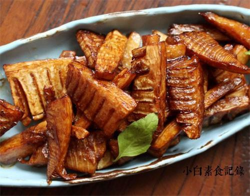

# 油焖冬笋

## 📋 基本資訊 / Recipe Overview
- **料理名稱**：油焖冬笋
- **原始標題**：油焖冬笋
- **素食流派 / Diet**：全素 Vegan
- **料理分類 / Category**：家常蔬食 / 经典热菜
- **來源平台 / Source**：[下廚房 · 素食主義專區](https://www.xiachufang.com/recipe/1012238/)

## 🌿 食材及佐料清單 / Ingredients
- 两只冬笋
- 2片生姜
- 三四粒冰糖
- 1/2小匙老抽
- 1大匙生抽

## 🍳 烹飪步驟 / Step-by-Step Cooking Steps
1. 冬笋去掉老根和笋衣，切成寸段，放入开水锅中，加盐焯烫七八分钟，这样可以去除涩味和过多的草酸钙（就是笋里面白色的东东）捞出沥干水分待用
2. 另起锅烧热，下宽油，下姜片煸香，下笋段翻炒至表面微焦，接着下入冰糖、老抽、生抽炒匀
3. 加半碗水到锅中，盖上锅盖小火焖5分钟，继续大火翻炒把汁收干即可出锅

## 💡 大廚美味秘訣 / Chef's Tips
- 笋一年四季都有，但是以春冬两季味道最为鲜美，冬笋肉质肥厚，春笋鲜嫩，各有特色 
油焖笋是江南菜，通常是用春笋做，今天试了冬笋味道也好

---
*食譜歸檔時間：2026-08-20 · 來源：下廚房 (www.xiachufang.com)*