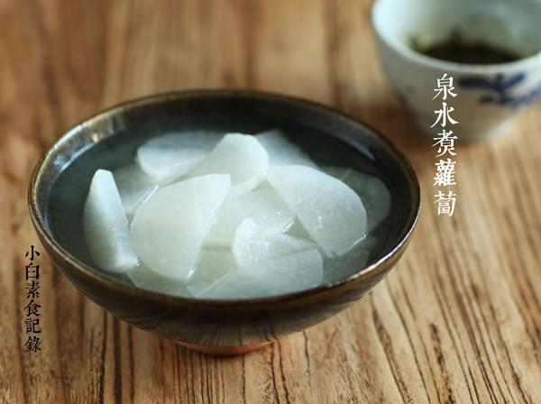

# 泉水煮萝卜

## 📋 基本資訊 / Recipe Overview
- **料理名稱**：泉水煮萝卜
- **原始標題**：泉水煮萝卜
- **素食流派 / Diet**：全素 Vegan
- **料理分類 / Category**：面食主食
- **來源平台 / Source**：[下廚房 · 素食主義專區](https://www.xiachufang.com/recipe/1075365/)

## 🌿 食材及佐料清單 / Ingredients
- 半根白萝卜
- 一颗香菜
- 半个新鲜朝天椒
- 3大匙生抽
- 1大匙陈醋
- 一点点花椒粉

## 🍳 烹飪步驟 / Step-by-Step Cooking Steps
1. 白萝卜去皮，对半切开，然后切0.5厘米的片，这样的形状比较容易夹取。放入锅中加矿泉水没过，盖上锅盖开中火煮20分钟即可
2. 香菜辣椒洗净，都切碎，放入碗中，加生抽陈醋花椒粉即可（这次买的辣椒比较辣，只用了半个，大家根据口味增减。生抽用的是六月鲜，味道偏甜所以没额外加糖，其他酱油根据口味可适量加一点糖）
3. 煮好的萝卜连汤带萝卜装入大碗，萝卜蘸调好的蘸水食用~

## 💡 大廚美味秘訣 / Chef's Tips
- 冬天经常这样吃，很舒服，吃完萝卜喝热乎的汤

---
*食譜歸檔時間：2026-08-20 · 來源：下廚房 (www.xiachufang.com)*