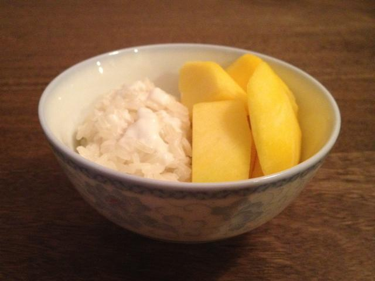

# 泰式芒果糯米饭

## 📋 基本資訊 / Recipe Overview
- **料理名稱**：泰式芒果糯米饭
- **原始標題**：泰式芒果糯米饭
- **素食流派 / Diet**：全素 Vegan
- **料理分類 / Category**：米食主食
- **來源平台 / Source**：[下廚房 · 素食主義專區](https://www.xiachufang.com/recipe/1080057/)

## 🌿 食材及佐料清單 / Ingredients
- 3个芒果（最好是象牙芒）
- 1听椰浆
- 1碗泰国双象糯米
- 1汤匙糖
- 1/4茶匙盐

## 🍳 烹飪步驟 / Step-by-Step Cooking Steps
1. 糯米隔夜泡好，沥干水份。水滚后保持中大火，上锅蒸20分钟。
2. 糯米蒸到15分钟左右，就可以开始煮椰浆了。新鲜搅拌的椰浆最好，没有的话用罐头椰浆也是一样的。这个是我用的椰浆。
3. 中火加热椰浆，椰浆热后加入1汤匙糖和1/4茶匙盐，不断搅拌。糖和盐完全融化，椰浆变得浓稠以后就可以关火了。
4. 煮好椰浆（大约五分钟），糯米也蒸好了。取一小团刚蒸好的热乎乎的糯米，放在碗的一边。在糯米上浇几汤匙煮好的椰浆，放5分钟，让糯米充分吸收椰浆。
5. 在碗的另一边摆上切块的芒果。吃之前再浇上几汤匙椰浆。

## 💡 大廚美味秘訣 / Chef's Tips
- － 这货是甜品啊不是饭不是主食啊亲。糯米蒸好了团*一小团*配芒果。是配芒果啊以芒果为主啊糯米饭占少部分。有几位蒸了一大碗当主食吃说真的能不腻么。
－有几位亲反映蒸糯米蒸不熟。我用的泰国双象糯米，比较细长，泡隔夜蒸20分钟肯定熟了。国内的圆糯米没做过真不清楚。用圆糯米请自行搜索。另外有几点千万注意：1）糯米必须泡隔夜8小时以上；2）水开以后上锅蒸，水要足，中大火；3）注意用量。
－ 泰国吃芒果糯米饭就是偏有嚼劲的感觉的，喜欢煮的软烂的也没问题，这是个人喜欢您自个儿看着办。
－一定要用罐头装的椰浆。椰树牌椰汁没有椰油，熬煮椰浆不好吃。
－椰浆只能中小火慢慢加热，大火加热椰浆会凝固的。
－糯米蒸好后要马上浇上热的椰浆，然后等待5分钟，让糯米吸收椰浆。这一步非常关键。糯米吸饱了椰浆，会变得更软润，更入味。
－糖和盐可以视个人喜好添加，一边煮一边尝一尝，调出自己喜欢的口味。
－在我们泰国，更讲究的做法是蒸糯米的时候加上清椰子水（不是椰奶椰浆，是椰子里的水）一起蒸。这我在美国真没有，只好不放了。

---
*食譜歸檔時間：2026-08-20 · 來源：下廚房 (www.xiachufang.com)*