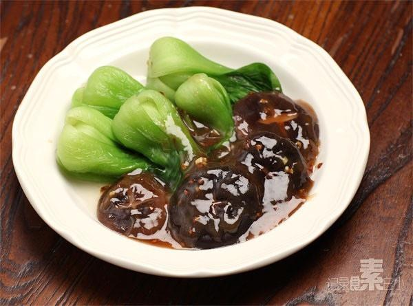

# 浇汁香菇油菜

## 📋 基本資訊 / Recipe Overview
- **料理名稱**：浇汁香菇油菜
- **原始標題**：浇汁香菇油菜
- **素食流派 / Diet**：全素 Vegan
- **料理分類 / Category**：面食主食
- **來源平台 / Source**：[下廚房 · 素食主義專區](https://www.xiachufang.com/recipe/1010375/)

## 🌿 食材及佐料清單 / Ingredients
- 几朵香菇
- 适量小油菜
- 1小匙姜末
- 1/2小匙淀粉
- 4大匙冷水
- 1大匙生抽
- 1/2小匙糖

## 🍳 烹飪步驟 / Step-by-Step Cooking Steps
1. 香菇洗净去蒂，小油菜洗净
2. 锅中烧开水，放入香菇和小油菜，香菇烫3分钟，小油菜烫1分钟，捞出装盘
3. 用1/2小匙淀粉、4大匙冷水、1大匙生抽、1/2小匙糖搅拌均匀成汁待用
4. 重新起锅烧热，下一点点油，下1小匙姜末炒香，然后倒入调好的汁搅拌，烧热浇在菜上即可

## 💡 大廚美味秘訣 / Chef's Tips
- 这一餐除了浇汁香菇油菜，还有梅子茶泡饭和椒盐蘑菇~ 
做法之前都发过，可搜索~ 
 
幸福就是该吃饭的时候认真吃饭，该睡觉的时候认真睡觉~

---
*食譜歸檔時間：2026-08-20 · 來源：下廚房 (www.xiachufang.com)*