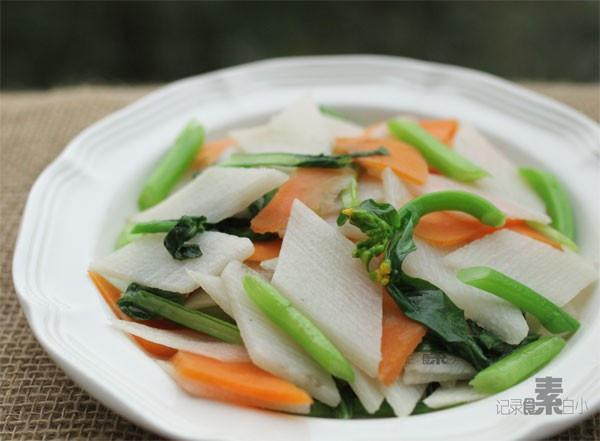

# 清炒山药

## 📋 基本資訊 / Recipe Overview
- **料理名稱**：清炒山药
- **原始標題**：清炒山药
- **素食流派 / Diet**：全素 Vegan
- **料理分類 / Category**：家常蔬食 / 经典热菜
- **來源平台 / Source**：[下廚房 · 素食主義專區](https://www.xiachufang.com/recipe/1005994/)

## 🌿 食材及佐料清單 / Ingredients
- 一段山药
- 半根胡萝卜
- 几根菜心
- 1/2小匙盐

## 🍳 烹飪步驟 / Step-by-Step Cooking Steps
1. 戴手套给山药去皮，斜切成段，再把段竖切成菱形片，放入水中洗掉粘液， 胡萝卜也这样切，菜心也切段
2. 锅中烧开水，下入山药和胡萝卜烫至水再次开起，捞出，菜心烫一下马上捞出
3. 重新起锅下少许油，下烫好的蔬菜加1/2小匙盐大火快速炒匀出锅即可

## 💡 大廚美味秘訣 / Chef's Tips
- 清脆爽口~清炒真是适合各种蔬菜呢 
 山药的好处不用多说了吧，据说连皮一起吃能发挥最佳作用，带着皮怎么才能好吃呢？我研究研究~

---
*食譜歸檔時間：2026-08-20 · 來源：下廚房 (www.xiachufang.com)*