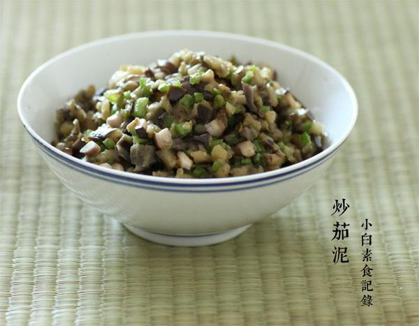

# 炒茄泥

## 📋 基本資訊 / Recipe Overview
- **料理名稱**：炒茄泥
- **原始標題**：炒茄泥
- **素食流派 / Diet**：全素 Vegan
- **料理分類 / Category**：家常蔬食 / 经典热菜
- **來源平台 / Source**：[下廚房 · 素食主義專區](https://www.xiachufang.com/recipe/1045836/)

## 🌿 食材及佐料清單 / Ingredients
- 两根茄子
- 1个尖椒
- 三四朵香菇
- 一块生姜
- 1/2小匙盐
- 1/2小匙糖
- 2小匙生抽

## 🍳 烹飪步驟 / Step-by-Step Cooking Steps
1. 备料，茄子洗净去蒂，切成厚片，放入烧开了水的蒸锅里盖锅盖蒸10分钟，取出稍微晾凉
2. 生姜切末，尖椒去蒂去籽切小丁，香菇去蒂切丁
3. 不烫手的蒸茄子用刀斩碎，待用
4. 锅烧热下少许油，先入1大匙姜末爆香，接着下香菇丁超软，然后下入尖椒丁翻炒一下，继续下茄子泥，加盐、糖、生抽调味翻炒均匀即可

## 💡 大廚美味秘訣 / Chef's Tips
- 茄子最好挑不嫩不老的，嫩茄子水分多，炒起来会水水的不好吃 
老茄子皮厚口感不适合做此菜~ 
尖椒定快炒一下即可，保持脆脆的口感 
拌饭最佳~

---
*食譜歸檔時間：2026-08-20 · 來源：下廚房 (www.xiachufang.com)*