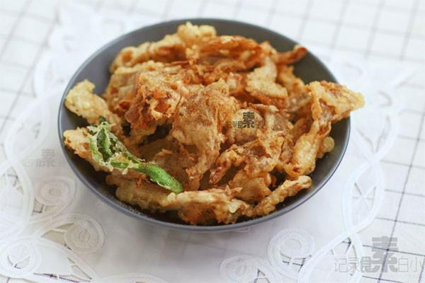

# 炸蘑菇

## 📋 基本資訊 / Recipe Overview
- **料理名稱**：炸蘑菇
- **原始標題**：炸蘑菇
- **素食流派 / Diet**：全素 Vegan
- **料理分類 / Category**：面食主食
- **來源平台 / Source**：[下廚房 · 素食主義專區](https://www.xiachufang.com/recipe/1001239/)

## 🌿 食材及佐料清單 / Ingredients
- 平菇
- 面粉
- 淀粉
- 泡打粉
- 盐
- 花椒粉

## 🍳 烹飪步驟 / Step-by-Step Cooking Steps
1. 平菇洗净用手撕成适合大小
2. 面粉和淀粉按2:1的比例加一点盐加水调成稠糊，可以加一点泡打粉，这样炸出的糊可以更蓬
3. 平菇放入淀粉糊中沾一下均匀裹上糊，放入烧热的油中160-180度，中小火炸至金黄捞出
4. 再次烧热油，大火把炸好的蘑菇再炸一下马上捞出，这样可以更酥脆
5. 撒上椒盐即可

## 💡 大廚美味秘訣 / Chef's Tips
- 用手指沾一下面糊，面糊既能均匀裹在手指上，又不会滴下，这种粘稠度最合适

---
*食譜歸檔時間：2026-08-20 · 來源：下廚房 (www.xiachufang.com)*