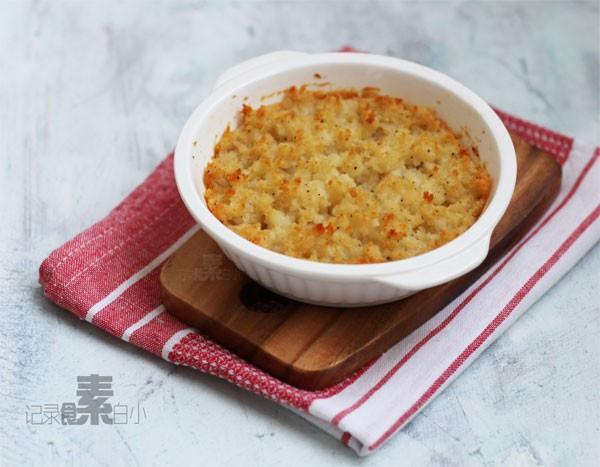

# 烤土豆泥

## 📋 基本資訊 / Recipe Overview
- **料理名稱**：烤土豆泥
- **原始標題**：烤土豆泥
- **素食流派 / Diet**：全素 Vegan
- **料理分類 / Category**：面食主食
- **來源平台 / Source**：[下廚房 · 素食主義專區](https://www.xiachufang.com/recipe/1004234/)

## 🌿 食材及佐料清單 / Ingredients
- 大号一个土豆
- 1大匙橄榄油
- 1/2小匙海盐
- 少许黑胡椒粉

## 🍳 烹飪步驟 / Step-by-Step Cooking Steps
1. 土豆洗净，去皮切块放入锅中蒸或煮熟
2. 土豆块加入橄榄油，盐，黑胡椒捣成泥
3. 土豆泥装入可烤箱用的容器中，用叉子捣松（保留空隙增加表面积)
4. 放入烤箱250度，上层 10分钟即可

## 💡 大廚美味秘訣 / Chef's Tips
- 土豆！土豆!前阵子某杂志采访小白的时候，问“你为什么那么喜欢吃土豆”我说“因为人人都喜欢吃土豆哇，而且很多时候土豆可以当做主食，这样多省事” 
 
好吧~今天又是土豆 
土豆泥，我好像没发过博客，因为实在太简单了，我还是大菜鸟的时候，就经常做土豆泥，今天做了土豆泥，但是在平常的基础上，又烤了一下，这样可以吃到我喜欢的土豆的焦香味

---
*食譜歸檔時間：2026-08-20 · 來源：下廚房 (www.xiachufang.com)*