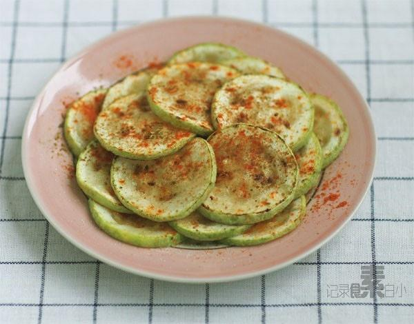

# 煎西葫芦

## 📋 基本資訊 / Recipe Overview
- **料理名稱**：煎西葫芦
- **原始標題**：煎西葫芦
- **素食流派 / Diet**：全素 Vegan
- **料理分類 / Category**：面食主食
- **來源平台 / Source**：[下廚房 · 素食主義專區](https://www.xiachufang.com/recipe/1001445/)

## 🌿 食材及佐料清單 / Ingredients
- 西葫芦
- 盐
- 孜然粉
- 辣椒粉

## 🍳 烹飪步驟 / Step-by-Step Cooking Steps
1. 挑选不太嫩的西葫芦，切成5MM左右的厚片
2. 平底锅烧热下少许油，把西葫芦片码入锅中，小火煎，一面煎个两分钟翻面再来两分钟即可
3. 西葫芦装入盘中，撒上盐，孜然和辣椒粉
4. 挑选不太嫩的西葫芦的原因是，嫩的西葫芦含水量高，一煎起来很容易出水 
煎好再放调料的目的也是一样，后放盐防止西葫芦出水

## 💡 大廚美味秘訣 / Chef's Tips
- 说起爱上西葫芦，也跟云南饭馆的烤西葫芦有关 
烤西葫芦，云南饭馆比较多见，很简单，就是切片的西葫芦，抹上油，盐，孜然，辣椒粉等进行碳烤。吃过这个之后我就知道了，自己不爱吃的是炒西葫芦，因为炒起来很容易出水，我却大爱烤西葫芦的味道 
今天的煎西葫芦跟烤的道理一样，只是量不多，大热天的也懒得折腾烤箱

---
*食譜歸檔時間：2026-08-20 · 來源：下廚房 (www.xiachufang.com)*