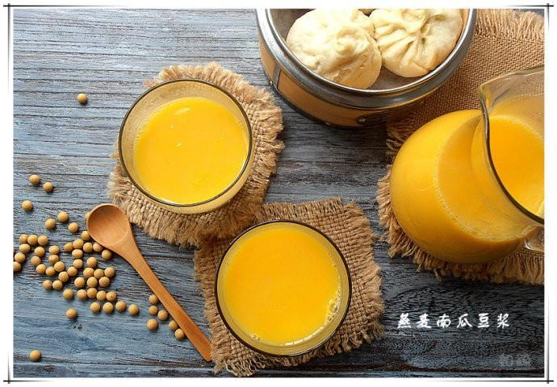

# 燕麦南瓜豆浆

## 📋 基本資訊 / Recipe Overview
- **料理名稱**：燕麦南瓜豆浆
- **原始標題**：燕麦南瓜豆浆
- **素食流派 / Diet**：全素 Vegan
- **料理分類 / Category**：家常蔬食 / 经典热菜
- **來源平台 / Source**：[下廚房 · 素食主義專區](https://www.xiachufang.com/recipe/98476/)

## 🌿 食材及佐料清單 / Ingredients
- 25g（豆浆机量豆杯半杯）黄豆
- 112g（差不多1个中等苹果那么大）去皮南瓜
- 10g（豆浆机量豆杯半杯）燕麦片

## 🍳 烹飪步驟 / Step-by-Step Cooking Steps
1. 将黄豆泡发
2. 南瓜切成黄豆大小
3. 所有材料入豆浆机用五谷豆浆功能键即可

## 💡 大廚美味秘訣 / Chef's Tips
- 燕麦片，用的西麦片或农贸市场里现轧的燕麦片都可以，不要那种加了味道哦~ 
南瓜用的黄花皮、长型的那种南瓜，如果用质地比较紧密或比较老的南瓜，去皮切粒时要小心操作以免切到手~ 
也可以在煲饭时顺便蒸好南瓜，直接用熟南瓜来做豆浆，能更省事省力一些~ 
直接把熟南瓜加在成品豆浆里，用料理机搅打亦美味~

---
*食譜歸檔時間：2026-08-20 · 來源：下廚房 (www.xiachufang.com)*