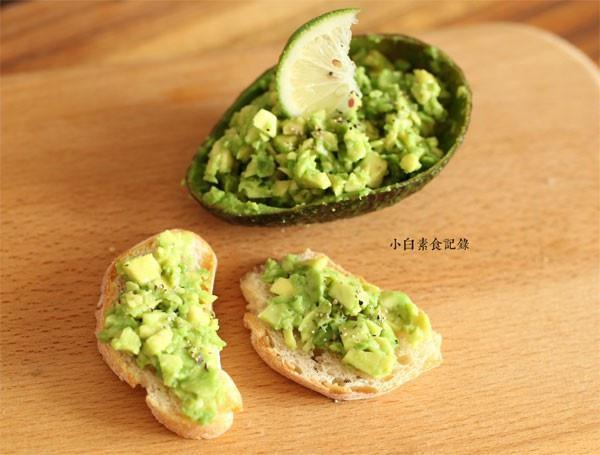

# 牛油果酱抹面包

## 📋 基本資訊 / Recipe Overview
- **料理名稱**：牛油果酱抹面包
- **原始標題**：牛油果酱抹面包
- **素食流派 / Diet**：全素 Vegan
- **料理分類 / Category**：面食主食
- **來源平台 / Source**：[下廚房 · 素食主義專區](https://www.xiachufang.com/recipe/1040196/)

## 🌿 食材及佐料清單 / Ingredients
- 一个牛油果
- 适量吐司或法棍
- 1/3小匙盐
- 一点点黑胡椒粉
- 半个小柠檬

## 🍳 烹飪步驟 / Step-by-Step Cooking Steps
1. 用刀沿着牛油果切一圈，要切到核为止，然后两只手拿着牛油果扭一下，就是图上这样了
2. 用勺子挖出果肉，捣碎，加上盐、胡椒粉、柠檬汁拌匀即可
3. 抹在用平底锅小火烤过的面包上，开吃~

## 💡 大廚美味秘訣 / Chef's Tips
- 牛油果如果不够熟的话不太容易捣碎，常温放置几天熟透再吃~

---
*食譜歸檔時間：2026-08-20 · 來源：下廚房 (www.xiachufang.com)*