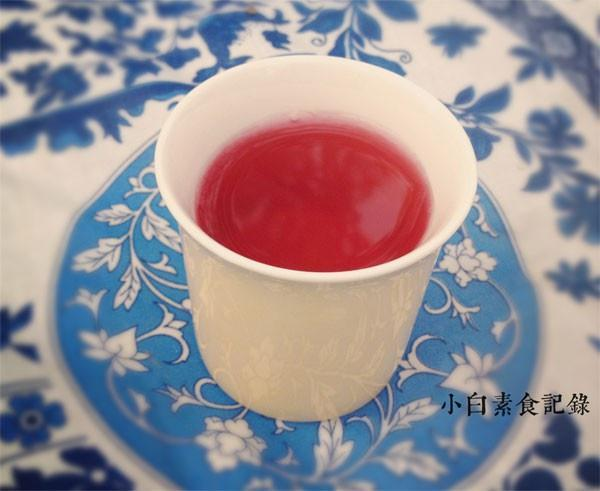

# 玫瑰洛神饮

## 📋 基本資訊 / Recipe Overview
- **料理名稱**：玫瑰洛神饮
- **原始標題**：玫瑰洛神饮
- **素食流派 / Diet**：全素 Vegan
- **料理分類 / Category**：家常蔬食 / 经典热菜
- **來源平台 / Source**：[下廚房 · 素食主義專區](https://www.xiachufang.com/recipe/1042457/)

## 🌿 食材及佐料清單 / Ingredients
- 十几朵干玫瑰
- 八九朵干玫瑰茄（洛神花）
- 20g冰糖
- 1200ml矿泉水

## 🍳 烹飪步驟 / Step-by-Step Cooking Steps
1. 准备原料，玫瑰茄，玫瑰花，冰糖，我放的糖量少，喜欢喝稍甜一点的可以根据口味添加
2. 所有原料和水一起放入锅中大火烧开后转小火煮5-10分钟（玫瑰花和洛神花的颜色都泡到水里了就ok了）
3. 将花瓣过滤出来，这样就可以畅饮了，冷却至常温后口味更佳

## 💡 大廚美味秘訣 / Chef's Tips
- 颜色漂亮味道酸酸甜甜的清爽饮料，无色素无添加，最重要是越喝越美哦 
玫瑰花，理气活血疏肝解郁 
洛神花也叫玫瑰茄，有健胃消食之用 
（以上两种皆可在卖花草茶的地方买到，在超市也很常见） 
在炎热夏天以自制饮料替代瓶装饮料，环保又健康 
以下是四人份量

---
*食譜歸檔時間：2026-08-20 · 來源：下廚房 (www.xiachufang.com)*