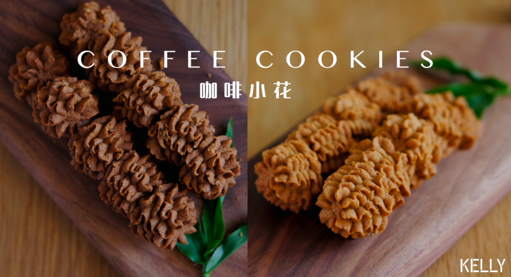

# 珍妮曲奇+网红曲奇 咖啡小花配方 烘焙视频饼干篇2

## 📋 基本資訊 / Recipe Overview
- **料理名稱**：珍妮曲奇+网红曲奇 咖啡小花配方 烘焙视频饼干篇2
- **原始標題**：(珍妮曲奇+网红曲奇)咖啡小花配方/烘焙视频饼干篇2
- **素食流派 / Diet**：奶素 Lacto-Vegetarian
- **料理分類 / Category**：面食主食
- **來源平台 / Source**：[下廚房 · 素食主義專區](https://www.xiachufang.com/recipe/102765953/)

## 🌿 食材及佐料清單 / Ingredients
- #珍妮曲奇配方，15朵#
- 70g黄油
- 7g咖啡酱（我使用的是韩国Roticafe咖啡酱，出来就是珍妮曲奇的味道）
- 17g糖粉或细砂糖（糖粉最佳）
- 0.5g（1/8小勺），就是一小撮，随意加一点即可。盐
- 25g玉米淀粉
- 70g低筋面粉
- #网红曲奇配方，15朵#
- 70g黄油
- 20g糖粉或细砂糖（糖粉最佳）
- 0.5g（1/8小勺），就是一小撮，随意加一点即可。盐
- 25g玉米淀粉
- 1包（1.8g）速溶黑咖啡粉（使用雀巢醇品）
- 3g可可粉
- 65g低筋面粉

## 🍳 烹飪步驟 / Step-by-Step Cooking Steps
1. 准备工作：
1.烤箱预热到120℃
2.准备八齿花嘴一枚（使用三能sn7092，之前所有的蛋糕都只用这款花嘴），裱花袋一只。
3.黄油至少提早一小时取出软化备用，直到打蛋头或手指可以轻松插入。
重点！黄油一定要一定要一定要软化到位！
如果没有时间，快速软化方法如下：
1.黄油切小块，微波炉10秒取出一次观察，直到呈现半凝固状态（即依旧是固体，但有少许液体油脂）。
2.黄油切小块，拿吹风机开热风对着吹。
3.黄油切小块，拿一盆温水（不要用烫手的水）泡着，该干嘛干嘛去洗个澡回来就好了。
最好的也是最省事的做法是：前一天晚上睡前把黄油放在打蛋盆里包好室温放置，第二天早上就从里软到外了。
2. 裱花袋剪一开口（用花嘴的尖端和裱花袋的尖头对齐，剪在花嘴的一半高度处，如有不够再补一刀。这样不会贸贸然把开口剪得太大）
3. 装入花嘴。（尖头向下）
套紧花嘴后右手握住裱花袋，左手旋转花嘴把开口收紧。
4. 取一杯子撑开裱花袋。
5. 黄油中加入咖啡酱，低速打散。
6. 完全软化的黄油可以轻松地打散，不会有太大阻力。
7. 加入糖盐。
8. 加入玉米淀粉。
9. 拌匀。
10. 用打蛋器的打蛋头把粘附在刮刀上的黄油刮下来。
11. 中速打发
12. 直至颜色变浅。
13. 筛入低粉。
14. 刮刀用压拌的手法，一边旋转打蛋盆一边压拌。
15. 直至面糊细腻，舀起面糊。
顺势刮在杯子边缘。
16. 把向外折的袋口翻回来，顺势转两圈把袋口拧紧。
然后把面糊向下挤到花嘴处。
17. 准备一个烤盘，铺上硅油纸或硅胶垫。
（硅胶垫会贴紧烤盘，但硅油纸最好在烤盘内滴几滴水或油固定住，不然挤花时会滑动）

挤出菊花状的花纹。
厚厚的曲奇花一般需要旋转4圈左右。
收口时向下轻轻压一下，放松即可断开。
18. 挤到后面会有面糊粘附在挤花袋上，左手握紧裱花袋的后部，用刮刀向前刮，将面糊聚拢到花嘴前端，不时切剁几下排出袋中的空气。
19. 如果一开始有不满意的，可以直接拿起来塞回挤花袋里挤到满意为止。
挤完用拇指轻轻摁一下曲奇的表面，压平断开时产生的尖角。
20. 接下来制作网红曲奇的咖啡小花。

如果没有黑咖啡粉，可以不下，可可粉增加至5g，制作可可曲奇。
21. 软化好的黄油打散。
22. 加入除了低筋面粉外所有材料。
（咖啡粉，可可粉，玉米淀粉，糖粉，盐）
23. 压拌均匀。
24. 中速打发。
25. 由外向里压拌至没有干粉。
此步骤可避免干粉溢出。
26. 形成细腻的面糊后装入裱花袋。
27. 挤花。
28. 摁平断开时产生的尖角。
29. 这款曲奇是厚而酥松的，要用低温慢烤的方式让内外酥透同时给予面糊足够的膨胀时间。
120℃，中层 45分钟。
然后转180℃，务必在一旁观察，略微上色就出炉，时间约为3-4分钟。
如果烤过头，饼干会焦苦。

取出，直接在盘子里即可，不用转移到晾架，太酥了容易碎。
务必完全冷却后食用。
密封保存，室温下可保存半个月，但建议尽早食用，口感最佳。

## 💡 大廚美味秘訣 / Chef's Tips
- 下一期是酥香（？）浓郁的榴莲曲奇，需要用到榴莲冻干粉，想做的可以先买。

---
*食譜歸檔時間：2026-08-20 · 來源：下廚房 (www.xiachufang.com)*