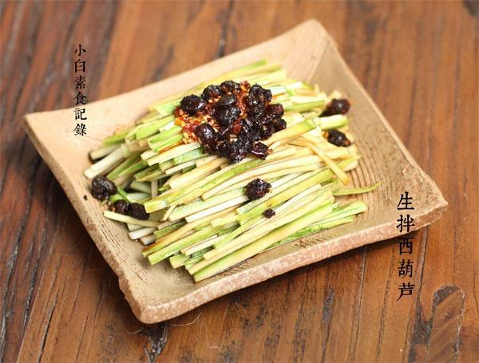

# 生拌西葫芦

## 📋 基本資訊 / Recipe Overview
- **料理名稱**：生拌西葫芦
- **原始標題**：生拌西葫芦
- **素食流派 / Diet**：全素 Vegan
- **料理分類 / Category**：家常蔬食 / 经典热菜
- **來源平台 / Source**：[下廚房 · 素食主義專區](https://www.xiachufang.com/recipe/1046639/)

## 🌿 食材及佐料清單 / Ingredients
- 一根嫩西葫芦
- 2小匙陈醋
- 1小匙生抽
- 1/2小匙盐
- 1/2小匙糖
- 2小匙老干妈豆豉辣酱
- 几滴香油

## 🍳 烹飪步驟 / Step-by-Step Cooking Steps
1. 挑选嫩西葫芦一根，表面撒盐揉搓后用水清洗干净
2. 西葫芦去掉两端，切成两段，取一段竖起来切片如图，然后切细丝，要顺着西葫芦的瓤切，因凉拌口感不好，所以把籽和瓤去掉，留下皮和肉切丝（籽和瓤和留烧汤用）
3. 切好的西葫芦丝加入所有调料拌匀即可食用

## 💡 大廚美味秘訣 / Chef's Tips
- 去重庆之前真的不知道西葫芦还能生吃 
但是真的好吃清新爽口呢，极力推荐给大家 
回家也忍不住自己试做~ 
炎炎夏日再拌个凉面或者提前熬好粥放凉，吃着真舒坦

---
*食譜歸檔時間：2026-08-20 · 來源：下廚房 (www.xiachufang.com)*