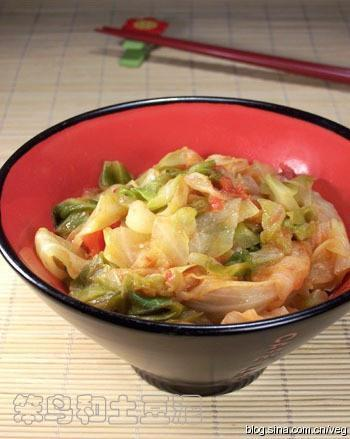

# 番茄圆白菜

## 📋 基本資訊 / Recipe Overview
- **料理名稱**：番茄圆白菜
- **原始標題**：番茄圆白菜
- **素食流派 / Diet**：全素 Vegan
- **料理分類 / Category**：家常蔬食 / 经典热菜
- **來源平台 / Source**：[下廚房 · 素食主義專區](https://www.xiachufang.com/recipe/15059/)

## 🌿 食材及佐料清單 / Ingredients
- 番茄
- 圆白菜
- 盐

## 🍳 烹飪步驟 / Step-by-Step Cooking Steps
1. 将圆白菜一层层剥开，洗净沥干，切成丝
2. 番茄切成小块
3. 坐锅热油，放入圆白菜丝翻炒，炒至圆白菜软塌，放入番茄块，加盐，继续翻炒至番茄出汤，白菜丝软烂即可出锅

## 💡 大廚美味秘訣 / Chef's Tips
- 最近常吃圆白菜，大多是和番茄一起炒着吃的，用来拌米饭吃很下饭。

---
*食譜歸檔時間：2026-08-20 · 來源：下廚房 (www.xiachufang.com)*