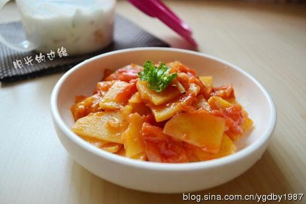

# 番茄土豆片

## 📋 基本資訊 / Recipe Overview
- **料理名稱**：番茄土豆片
- **原始標題**：番茄土豆片
- **素食流派 / Diet**：全素 Vegan
- **料理分類 / Category**：家常蔬食 / 经典热菜
- **來源平台 / Source**：[下廚房 · 素食主義專區](https://www.xiachufang.com/recipe/260337/)

## 🌿 食材及佐料清單 / Ingredients
- 土豆
- 番茄
- 姜丝
- 盐
- 植物油

## 🍳 烹飪步驟 / Step-by-Step Cooking Steps
1. 番茄切片，姜切丝，如果喜欢脆的，或者锅不是不沾的，可以泡一下土豆片
2. 炒锅里放油，煸香姜丝，放入土豆片不断翻炒，炒至有些透明
3. 放入番茄块，加一些盐，小火烧
4. 加一些盐，烧入味即可

## 💡 大廚美味秘訣 / Chef's Tips
- 1、如果用的不粘锅，土豆片不泡也行，喜欢脆一些的就加白醋泡泡。 
2、炝锅的材料，葱姜蒜都可以，都好吃，看个人喜好了。 
3、如果希望颜色更红一些，加点生抽一起烧。

---
*食譜歸檔時間：2026-08-20 · 來源：下廚房 (www.xiachufang.com)*