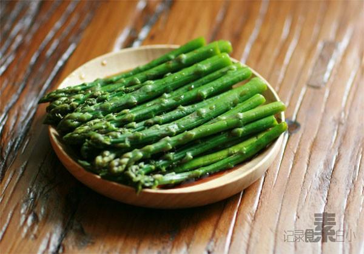

# 白灼芦笋

## 📋 基本資訊 / Recipe Overview
- **料理名稱**：白灼芦笋
- **原始標題**：白灼芦笋
- **素食流派 / Diet**：全素 Vegan
- **料理分類 / Category**：家常蔬食 / 经典热菜
- **來源平台 / Source**：[下廚房 · 素食主義專區](https://www.xiachufang.com/recipe/1000810/)

## 🌿 食材及佐料清單 / Ingredients
- 芦笋
- 生抽
- 盐
- 油

## 🍳 烹飪步驟 / Step-by-Step Cooking Steps
1. 芦笋洗净切掉末端
2. 锅中烧开水，加少许盐和几滴油，将芦笋放入烫一两分钟，捞出过凉水，可让芦笋更绿更脆
3. 将芦笋码齐，切成适宜长度，装盘浇生抽即可

## 💡 大廚美味秘訣 / Chef's Tips
- 应季芦笋，鲜嫩可爱，适宜简单烹饪 
已入夏，白灼的各种鲜蔬当道

---
*食譜歸檔時間：2026-08-20 · 來源：下廚房 (www.xiachufang.com)*