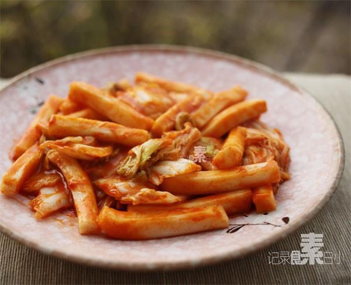

# 白菜炒年糕

## 📋 基本資訊 / Recipe Overview
- **料理名稱**：白菜炒年糕
- **原始標題**：白菜炒年糕
- **素食流派 / Diet**：全素 Vegan
- **料理分類 / Category**：面点小吃
- **來源平台 / Source**：[下廚房 · 素食主義專區](https://www.xiachufang.com/recipe/1009170/)

## 🌿 食材及佐料清單 / Ingredients
- 白菜
- 年糕
- 2大匙韩式辣椒酱

## 🍳 烹飪步驟 / Step-by-Step Cooking Steps
1. 锅中烧开1小碗水，下入年糕煮三四分钟，然后下入撕开的白菜再煮2分钟
2. 加入2大匙辣椒酱翻炒，水分基本上被年糕吸收了，只有粘稠的红色汤汁，炒匀即可出锅

## 💡 大廚美味秘訣 / Chef's Tips
- 又是快手简便的美味，忙的时候不妨这样弄一盘，菜和饭就都解决了~

---
*食譜歸檔時間：2026-08-20 · 來源：下廚房 (www.xiachufang.com)*