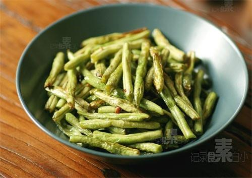

# 省时少油的干煸四季豆

## 📋 基本資訊 / Recipe Overview
- **料理名稱**：省时少油的干煸四季豆
- **原始標題**：省时少油的干煸四季豆
- **素食流派 / Diet**：全素 Vegan
- **料理分類 / Category**：家常蔬食 / 经典热菜
- **來源平台 / Source**：[下廚房 · 素食主義專區](https://www.xiachufang.com/recipe/1000859/)

## 🌿 食材及佐料清單 / Ingredients
- 一把四季豆
- 一手心花椒
- 四五个干辣椒
- 盐
- 糖

## 🍳 烹飪步驟 / Step-by-Step Cooking Steps
1. 四季豆洗净掐掉两端，顺势撕掉老筋，掰成段
2. 放入盘中，微波炉高火四五分钟，中途取出搅拌一下
3. 起锅烧油，下花椒和干辣椒小火炒香，铲出花椒~以防吃到小地雷
4. 下入四季豆翻炒，炒出虎皮后加盐和糖调味即可

## 💡 大廚美味秘訣 / Chef's Tips
- 以前炒这道菜经常遇到这个问题，外面都糊掉了，里面还夹生~而且在油锅前一站就是20分钟 
今天这种方法特别省时间，而且很容易炒出虎皮，不需要担心四季豆夹生

---
*食譜歸檔時間：2026-08-20 · 來源：下廚房 (www.xiachufang.com)*