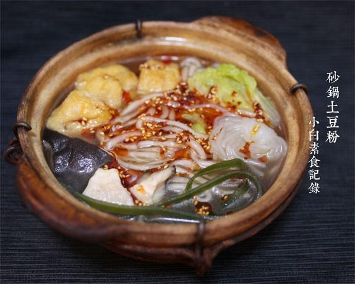

# 砂锅土豆粉

## 📋 基本資訊 / Recipe Overview
- **料理名稱**：砂锅土豆粉
- **原始標題**：砂锅土豆粉
- **素食流派 / Diet**：全素 Vegan
- **料理分類 / Category**：面食主食
- **來源平台 / Source**：[下廚房 · 素食主義專區](https://www.xiachufang.com/recipe/1011311/)

## 🌿 食材及佐料清單 / Ingredients
- 一人份土豆粉
- 魔芋结
- 两朵香菇
- 少许海带丝
- 几个豆腐泡
- 几片大白菜
- 1小匙盐
- 1/2小匙糖
- 1大匙生抽
- 少许花椒粉
- 1大匙辣椒油

## 🍳 烹飪步驟 / Step-by-Step Cooking Steps
1. 锅中烧开水，下土豆粉煮熟，捞出过凉水待用
2. 砂锅中加足水，下香菇和海带丝一起煮至水开，此时汤就是方便的香菇海带高汤啦~接着下入魔芋结、 豆腐泡煮两分钟，然后下大白菜、土豆粉，加入除辣椒油之外的所有调料煮开即可
3. 吃的时候根据喜好加点辣椒油啊醋啊什么的~

## 💡 大廚美味秘訣 / Chef's Tips
- 之前就想做，但是没买到土豆粉，最近市场卖豆腐的摊多了新鲜的土豆粉，还是无添加无防腐剂的，果断买了半斤，够我吃两顿的~ 
我记得有次去吃类似麻辣烫的捞菜，厨师小伙子现场操作，最后毫不避讳的放入两种不知名的乳白色粉末，问是什么也拒不回答，餐饮业的潜规则就是这样，各种化学增鲜剂，高汤粉，为什么饭馆的味道都很接近？ 
所以大家别盲目追求“馆子味”，除了高油、高盐、高勾芡之外，还有大量你不知道的化学成分，被美其名曰“秘方”，经常在外就餐的人已经不知道到底什么是食物的本味了~ 
所以，在追求“美味”的同时，想一想，你追求的是添加剂还是真正的美好味道

---
*食譜歸檔時間：2026-08-20 · 來源：下廚房 (www.xiachufang.com)*