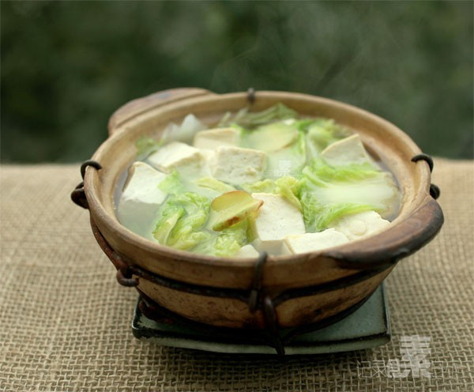

# 砂锅白菜豆腐

## 📋 基本資訊 / Recipe Overview
- **料理名稱**：砂锅白菜豆腐
- **原始標題**：砂锅白菜豆腐
- **素食流派 / Diet**：全素 Vegan
- **料理分類 / Category**：家常蔬食 / 经典热菜
- **來源平台 / Source**：[下廚房 · 素食主義專區](https://www.xiachufang.com/recipe/1005850/)

## 🌿 食材及佐料清單 / Ingredients
- 北豆腐
- 白菜
- 几片姜
- 1/2小匙盐

## 🍳 烹飪步驟 / Step-by-Step Cooking Steps
1. 白菜用手撕开，豆腐切块待用
2. 砂锅内加足量水，烧开，下入白菜、豆腐、姜片煮至再次开起
3. 加入盐继续小火煮10分钟左右即可，关火前可滴几滴香油

## 💡 大廚美味秘訣 / Chef's Tips
- 最简单家常不过，在外却很难吃到这么顺心的，不是加了猪油，就是加了面粉做的白汤 
很多时候，就想吃这种再清淡不过的菜，热乎乎，暖心暖胃~

---
*食譜歸檔時間：2026-08-20 · 來源：下廚房 (www.xiachufang.com)*