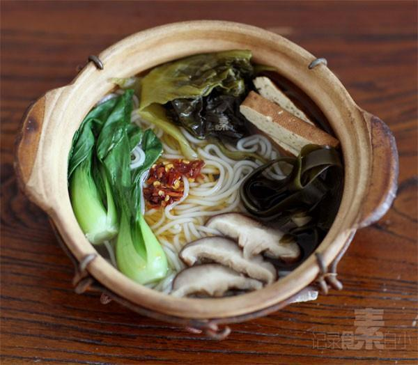

# 砂锅米线

## 📋 基本資訊 / Recipe Overview
- **料理名稱**：砂锅米线
- **原始標題**：砂锅米线
- **素食流派 / Diet**：全素 Vegan
- **料理分類 / Category**：面食主食
- **來源平台 / Source**：[下廚房 · 素食主義專區](https://www.xiachufang.com/recipe/1001626/)

## 🌿 食材及佐料清單 / Ingredients
- 米线
- 海带
- 四川酸菜
- 香干
- 香菇
- 榨菜
- 小油菜
- 盐
- 生抽

## 🍳 烹飪步驟 / Step-by-Step Cooking Steps
1. 砂锅放冷水和米线一起煮至发软
2. 趁着煮米线的功夫收拾菜，干海带泡软切丝，香菇切片，四川酸菜撕开，小油菜洗净，香干切条
3. 米线软了，放入有调味作用的四川酸菜，香菇，海带
4. 加少许盐，生抽
5. 最后临出锅时放香干，榨菜和小油菜，油菜烫熟即可关火
6. 根据个人喜欢加点醋，辣椒油~

## 💡 大廚美味秘訣 / Chef's Tips
- 昨天北京的超大暴雨一过，今天天气无比凉爽 
谢谢大家关心~我很好，昨天下雨的时候我还去菜市场买了个菜，人少，雨声大，我不怕人听见边走边唱歌 
昨晚厨房也无比凉爽，又熬了一大锅果酱~~~~~ 
 天一凉快就想折腾砂锅，有朋友说让我做个汤汤水水的纪念下昨天的大雨 
 来个米线吧~

---
*食譜歸檔時間：2026-08-20 · 來源：下廚房 (www.xiachufang.com)*