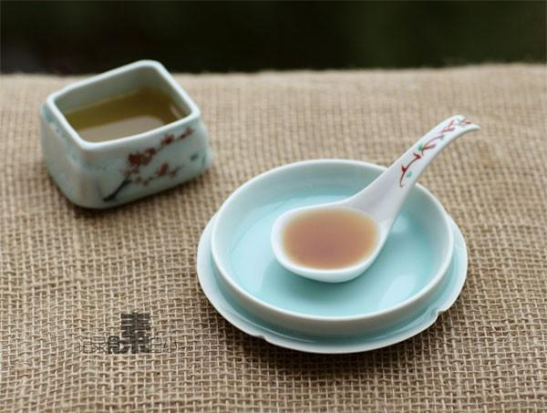

# 秋梨膏

## 📋 基本資訊 / Recipe Overview
- **料理名稱**：秋梨膏
- **原始標題**：秋梨膏
- **素食流派 / Diet**：全素 Vegan
- **料理分類 / Category**：家常蔬食 / 经典热菜
- **來源平台 / Source**：[下廚房 · 素食主義專區](https://www.xiachufang.com/recipe/1004372/)

## 🌿 食材及佐料清單 / Ingredients
- 2500g梨
- 几个红枣
- 50g冰糖或蜂蜜
- 20g干百合（或鲜百合一头）

## 🍳 烹飪步驟 / Step-by-Step Cooking Steps
1. 梨洗净，去皮去核切成小块，干百合（或直接用新鲜百合两头）用水泡软，红枣去核留肉，一起放入搅拌机中打成泥
2. 把搅拌好的混合物放入锅中，大火煮开后转小火煮30分钟左右
3. 把锅里的混合物用滤网过滤一下（用勺子不断的压），把汁留在锅里，剩下的泥再用纱布（两块叠起来用）挤一下，把汁挤到锅中。（此步骤注意不要烫到手）
4. 泥扔掉，汁留在锅里加入冰糖继续小火煮30分钟以上，直至微微有一点变浓稠，冷却后会更浓稠一点（如过不加冰糖只加蜂蜜的话要待梨膏冷却后拌入）
5. 冷却后装入无水无油的干净可密封容器中入冰箱冷藏，每次用干净的勺子取，至少可保存一个月

## 💡 大廚美味秘訣 / Chef's Tips
- 天这2500g梨最后只熬出了250ml的梨膏，大概是10：1 
 
食用方法：舀一勺用沸水冲开饮用（如果加了蜂蜜只能用温水哦） 
 
秋梨膏有生津止渴、润肺清心、防燥降火等功效。 
 
润肺清心~清得了心火，但是清不了心事哦 
要是真有烦心上火事，还是得从内“心”上解决

---
*食譜歸檔時間：2026-08-20 · 來源：下廚房 (www.xiachufang.com)*