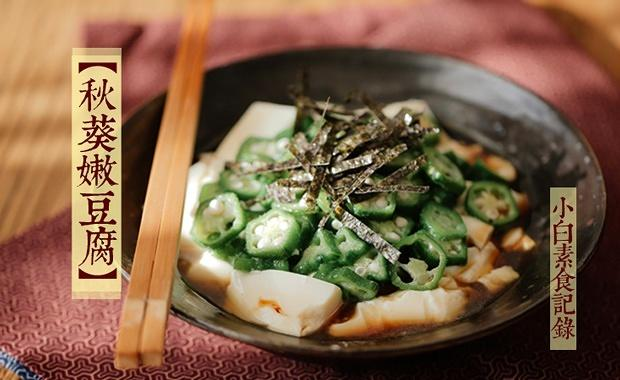

# 秋葵嫩豆腐&秋葵存储小方法

## 📋 基本資訊 / Recipe Overview
- **料理名稱**：秋葵嫩豆腐&秋葵存储小方法
- **原始標題**：秋葵嫩豆腐&秋葵存储小方法
- **素食流派 / Diet**：全素 Vegan
- **料理分類 / Category**：家常蔬食 / 经典热菜
- **來源平台 / Source**：[下廚房 · 素食主義專區](https://www.xiachufang.com/recipe/100448275/)

## 🌿 食材及佐料清單 / Ingredients
- 6-7个秋葵
- 一盒内酯豆腐
- 1大匙醋
- 2小匙生抽
- 1/2小匙糖
- 少许海苔丝

## 🍳 烹飪步驟 / Step-by-Step Cooking Steps
1. 先用盐搓洗秋葵表面，去掉毛毛，将秋葵放入烧开的水中烫两三分钟，捞出放入冷水中过晾，然后将秋葵切片待用。
2. 内酯豆腐切块，摆入深盘中，上面摆好处理过的秋葵。
3. 将醋、生抽和糖混合均匀，沿盘边淋一圈，最后撒上海苔丝即可。

## 💡 大廚美味秘訣 / Chef's Tips
- 很快手的凉菜，青白如玉，滑滑的嫩嫩的清爽极了。秋葵是很健康的食材，买了一盒一次吃不了，或者想在盛产的季节多储存一些，告诉大家一个很简单方便的方法。
可以把秋葵用盐搓过后放入开水中焯熟，然后捞出过冷水，
最后控掉水分冷冻，吃的时候直接解冻就可以啦！
解冻的时候不要等完全化掉再切，那样会切的扁扁的，取出秋葵稍微化一下，能切动的时候就切好，这样切出来是漂亮的小星星们。
是不是觉得画风变了呢？特别鸣谢本道菜谱特邀摄影湿@晴天小超人 鼓掌~~~~~

---
*食譜歸檔時間：2026-08-20 · 來源：下廚房 (www.xiachufang.com)*