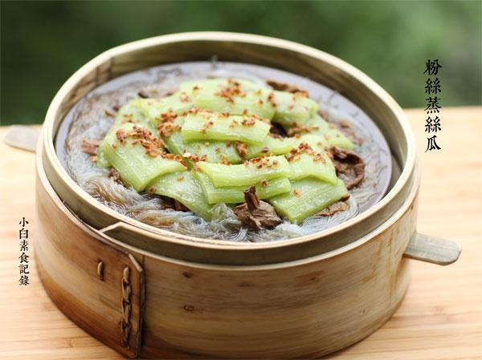

# 粉丝蒸丝瓜

## 📋 基本資訊 / Recipe Overview
- **料理名稱**：粉丝蒸丝瓜
- **原始標題**：粉丝蒸丝瓜
- **素食流派 / Diet**：全素 Vegan
- **料理分類 / Category**：面食主食
- **來源平台 / Source**：[下廚房 · 素食主義專區](https://www.xiachufang.com/recipe/1046564/)

## 🌿 食材及佐料清單 / Ingredients
- 一根丝瓜
- 一小捆粉丝
- 一把茶树菇
- 2大匙姜末
- 2大匙油
- 2大匙生抽
- 1/2小匙盐
- 1/2小匙糖

## 🍳 烹飪步驟 / Step-by-Step Cooking Steps
1. 2大匙生抽和1/2小匙糖1/2小匙盐混合均匀做调味汁待用。粉丝用冷水泡软后剪成5厘米左右的段，均匀铺在盘子底，浇上2小匙刚才调好的汁
2. 接着把提前浸泡好的茶树菇切成寸段，铺上粉丝上，当然如果有新鲜的茶树菇更好，再浇上2小匙调好的汁
3. 丝瓜去皮也切成段（先切成几段，然后竖着再切开，如果籽太多可去掉一部分籽）铺在茶树菇上，把剩下的调味汁浇上
4. 锅烧热下2大匙油，下入2大匙姜末小火煸至姜末干酥，然后将这个姜油均匀浇在摆好的菜上。蒸锅水烧开后将菜放入蒸锅中，大火蒸10分钟即可

## 💡 大廚美味秘訣 / Chef's Tips
- 很喜欢的一道丝瓜菜 
最下铺上粉丝，中间是茶树菇，最上是丝瓜，大火蒸熟了特别下饭

---
*食譜歸檔時間：2026-08-20 · 來源：下廚房 (www.xiachufang.com)*