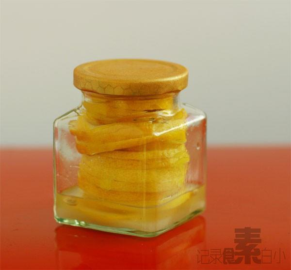

# 糖渍柠檬

## 📋 基本資訊 / Recipe Overview
- **料理名稱**：糖渍柠檬
- **原始標題**：糖渍柠檬
- **素食流派 / Diet**：全素 Vegan
- **料理分類 / Category**：家常蔬食 / 经典热菜
- **來源平台 / Source**：[下廚房 · 素食主義專區](https://www.xiachufang.com/recipe/36119/)

## 🌿 食材及佐料清單 / Ingredients
- 几个（依容器大小定）柠檬
- 一个可密封容器
- 白糖

## 🍳 烹飪步驟 / Step-by-Step Cooking Steps
1. 容器洗净晾干，柠檬洗净，晾干表面，去头尾，切成3MM厚片
2. 柠檬片码入容器，一层柠檬撒一层白糖。。。。最后一层多撒点白糖，密封容器放入冰箱冷藏2天即可

## 💡 大廚美味秘訣 / Chef's Tips
- 冬天的下午容易昏沉，暖暖的柠檬红茶喝下去仿佛能瞬间唤醒沉睡的细胞 
我爱喝各种各样的茶，中国传统的绿茶红茶普洱茶乌龙茶。。。也爱西式的柠檬红茶柠檬绿茶 
逛街的时候，夏天喝冰的柠檬绿茶，冬天喝热的柠檬红茶，一直如此。快乐柠檬~找茶~都爱 
以前在家自己泡总觉得不够味，用新鲜的柠檬泡出来有点苦涩，跟卖的不一样，而且一个柠檬用不完，往往就干掉了，好浪费。 
糖渍柠檬这个方法很好，保存时间长，随喝随取，而且避免浪费，因为制作的时候放了糖，所以泡茶时只需一个红茶包（我用的是立顿精选红茶），两片糖渍柠檬就可以了，无需另外加糖。 
对于严格素食者来说，糖渍的柠檬不含蜂蜜，完美~

---
*食譜歸檔時間：2026-08-20 · 來源：下廚房 (www.xiachufang.com)*