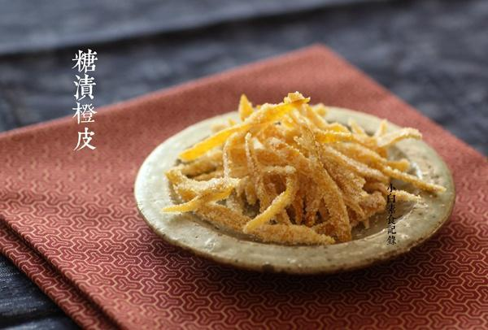

# 糖渍橙皮

## 📋 基本資訊 / Recipe Overview
- **料理名稱**：糖渍橙皮
- **原始標題**：糖渍橙皮
- **素食流派 / Diet**：全素 Vegan
- **料理分類 / Category**：家常蔬食 / 经典热菜
- **來源平台 / Source**：[下廚房 · 素食主義專區](https://www.xiachufang.com/recipe/1071836/)

## 🌿 食材及佐料清單 / Ingredients
- 四个橙皮
- 100g+80g白砂糖
- 100g水

## 🍳 烹飪步驟 / Step-by-Step Cooking Steps
1. 取皮。橙子用盐搓洗下冲干净，一切八瓣，吃掉橙子肉，橙皮用小刀，像图上这样，把白色部分尽量去干净，只留下橙黄色的果皮（白色部分味道涩，尽量去干净，我用的橙子皮很薄，这样去皮都很轻松，所以相信普通橙子更容易去皮）
2. 去涩。把橙皮放入锅中加足量水，大火烧开后转小火煮10分钟，进一步去涩。然后捞出，切成0.5厘米宽的条
3. 煮制。将橙皮条和100g糖100g水放入锅中，小火将糖煮化，不时搅拌一下，小火煮10分钟，橙皮变的半透明了即可（请不要离开锅，要小火，不停搅拌，以防糊锅，如果您用的橙皮比较厚，适当延长煮的时间，直到橙皮颜色半透明）捞出橙皮，铺在平盘上，晾一个小时，让它水分蒸发一下（锅中会剩下2-3大匙的橙色糖浆，不要扔掉哦，取1小匙冲水喝，或者泡红茶都非常好，橙香四溢。）晾好的橙条放在砂糖里沾满糖粒
4. 沾满糖的橙皮，还放在干净的盘中，晾一夜，让 多余的水分再蒸发一下，这样可延长保存期，密封常温保存两三个月肯定没问题

## 💡 大廚美味秘訣 / Chef's Tips
- 1.我用的橙子皮薄，如果普通橙子，需要适当延长焯水和煮的时间 
2.不用为了做橙皮而狂吃橙子，橙皮可以先晾干，等数量够了再煮软，去白瓤炮制，味道没有影响的。

---
*食譜歸檔時間：2026-08-20 · 來源：下廚房 (www.xiachufang.com)*