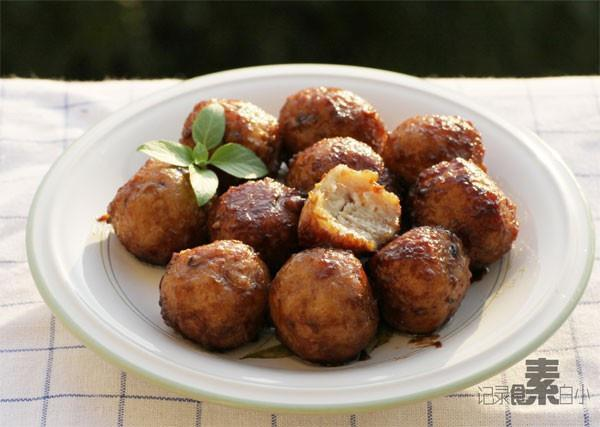

# 糖醋藕元

## 📋 基本資訊 / Recipe Overview
- **料理名稱**：糖醋藕元
- **原始標題**：糖醋藕元
- **素食流派 / Diet**：全素 Vegan
- **料理分類 / Category**：面食主食
- **來源平台 / Source**：[下廚房 · 素食主義專區](https://www.xiachufang.com/recipe/1004900/)

## 🌿 食材及佐料清單 / Ingredients
- 500g藕
- 三四朵香菇
- 2大匙面粉
- 1/2小匙盐
- 1大匙生抽
- 1大匙醋
- 1小匙糖

## 🍳 烹飪步驟 / Step-by-Step Cooking Steps
1. 莲藕洗净去褐色表皮，用擦丝器擦成茸，用手挤干藕茸的水分待用
2. 香菇洗净去蒂切碎，与挤掉水分的藕茸还有2大匙面粉一起拌匀
3. 加入1/2小匙盐和少许白胡椒粉继续拌匀。用手团成小丸子
4. 锅中烧开一锅水，下入团好的丸子汆烫四五分钟左右，捞出
5. 重新起锅烧热，下一点点油，下入丸子翻炒，再下生抽、醋、糖炒匀上色收汁即可

## 💡 大廚美味秘訣 / Chef's Tips
- 1.今天用的汆丸子的方法，其实直接拍饼煎了也好吃，或者炸了丸子也行 
2.汆好的丸子可以直接冷冻起来随吃随取，炒烩烧汤皆可 
3.汆丸子的时候水里会有少许藕茸，放心继续很正常。注意1个是一定要挤干藕茸里的水分，否则容易散，口感也没那么Q。再就是丸子要捏紧。 
4.藕茸挤出的水分，加点糖小火煮熟，就是藕粉！一点都不浪费 
5.汆丸子的时候，锅里水要开，但是不能太滚，否则也容易散 
这道菜非常开胃，让我惊奇的是口感居然是紧实Q弹，而且做起来真的挺简单

---
*食譜歸檔時間：2026-08-20 · 來源：下廚房 (www.xiachufang.com)*