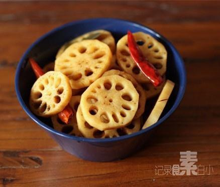

# 素卤藕片

## 📋 基本資訊 / Recipe Overview
- **料理名稱**：素卤藕片
- **原始標題**：素卤藕片
- **素食流派 / Diet**：全素 Vegan
- **料理分類 / Category**：家常蔬食 / 经典热菜
- **來源平台 / Source**：[下廚房 · 素食主義專區](https://www.xiachufang.com/recipe/1002134/)

## 🌿 食材及佐料清單 / Ingredients
- 一两节藕
- 两片生姜
- 三四个干辣椒
- 十几颗花椒
- 两片香叶
- 两三个八角
- 一两段桂皮
- 几块冰糖
- 两勺盐
- 三四个香菇蒂
- 两大勺老抽

## 🍳 烹飪步驟 / Step-by-Step Cooking Steps
1. 挑选表面颜色浅的嫩藕，去皮切片洗净
2. 锅中烧开水，加所有调料及藕片小火煮30分钟，关火再泡30分钟
3. 捞出晾凉即可食用

## 💡 大廚美味秘訣 / Chef's Tips
- 平时吃新鲜香菇可以把切下的香菇蒂洗净晾干，作为天然的调味品可以煮汤，炖菜时加入 
 提鲜环保

---
*食譜歸檔時間：2026-08-20 · 來源：下廚房 (www.xiachufang.com)*