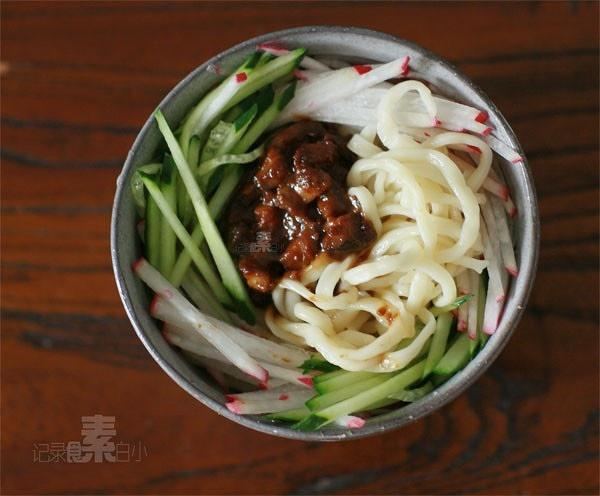

# 素炸酱面

## 📋 基本資訊 / Recipe Overview
- **料理名稱**：素炸酱面
- **原始標題**：素炸酱面
- **素食流派 / Diet**：全素 Vegan
- **料理分類 / Category**：面食主食
- **來源平台 / Source**：[下廚房 · 素食主義專區](https://www.xiachufang.com/recipe/1001319/)

## 🌿 食材及佐料清單 / Ingredients
- 鲜面条
- 黄瓜
- 水萝卜
- 香菇
- 黄豆酱

## 🍳 烹飪步驟 / Step-by-Step Cooking Steps
1. 香菇洗净切丁，锅烧热下宽油，加香菇丁炒香（喜欢吃辣的可加点干辣椒）
2. 加入黄豆酱小火不停翻炒熬制几分钟即成炸酱
3. 另起锅里烧开水下面条煮熟，捞出过凉水
4. 黄瓜水萝卜洗净先斜切长片，再切丝
5. 面入碗中，配上黄瓜水萝卜丝，舀上一勺香菇炸酱拌匀开吃~

## 💡 大廚美味秘訣 / Chef's Tips
- 香菇一定要多放，口感好，味道鲜，绝对不比荤酱差 
黄豆酱不要买干黄酱，最好买别太干的，也不用再掺甜面酱，省事了~

---
*食譜歸檔時間：2026-08-20 · 來源：下廚房 (www.xiachufang.com)*