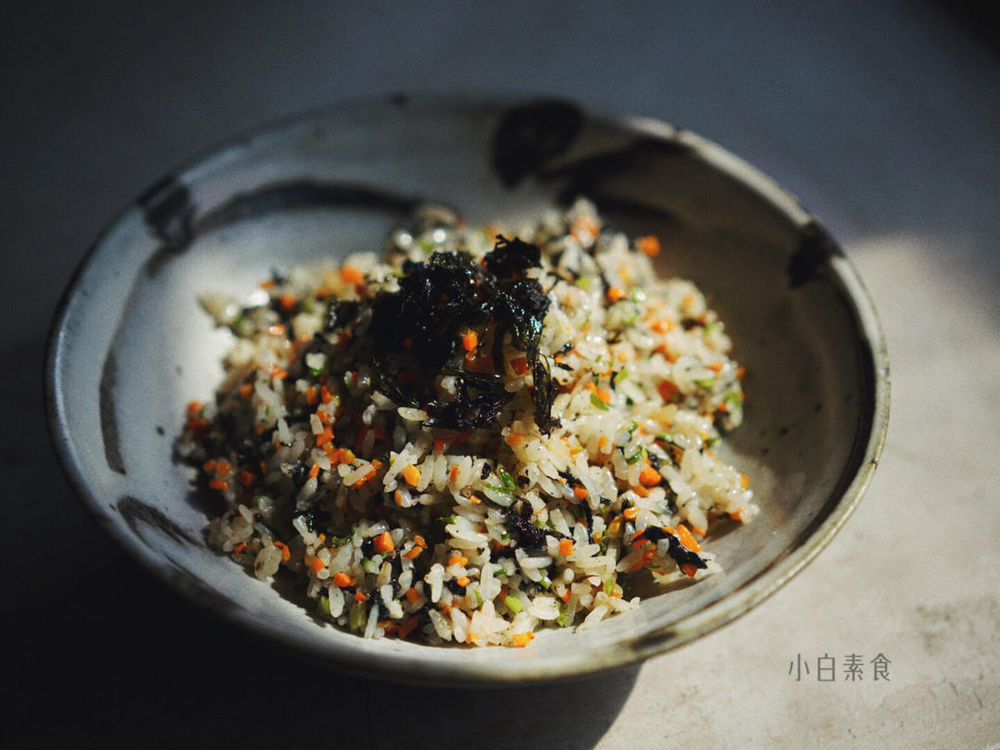

# 紫菜糯米炒饭

## 📋 基本資訊 / Recipe Overview
- **料理名稱**：紫菜糯米炒饭
- **原始標題**：紫菜糯米炒饭
- **素食流派 / Diet**：全素 Vegan
- **料理分類 / Category**：米食主食
- **來源平台 / Source**：[下廚房 · 素食主義專區](https://www.xiachufang.com/recipe/102231002/)

## 🌿 食材及佐料清單 / Ingredients
- 160g大米
- 80g糯米
- 10g紫菜（不是海苔）
- 一头大蒜
- 一根（小）胡萝卜
- 一棵香芹
- 10g+10g食用油
- 1/2小匙盐

## 🍳 烹飪步驟 / Step-by-Step Cooking Steps
1. 备料，糯米和大米比例为1：2，糯米提前浸泡2小时，然后与大米一起洗净，加1.1-1.2倍的水放电饭锅煮熟，具体水量根据自己吃的米来调节，总之米饭不要煮太软。
2. 紫菜用剪刀剪碎，这样一盘紫菜只有10g~
3. 温锅下10g冷油，放入紫菜碎小火慢炒，图中是炒了1分钟的样子，要不停翻炒，我炒到2分半的时候关火，继续用余温炒了30秒，出锅。紫菜一定要用小火，不然很容易糊，炒的过程不要离开锅，油要稍微多一点，这样才可以把紫菜炒酥。
4. 炒好的紫菜体积会变少，颜色会有一点偏黄绿色，触感是酥酥的，尝起来有一点焦香。
5. 大蒜切成这样大小，不要切成末，两人份一头蒜，一人份半头蒜，放心，吃起来一点也不会觉得蒜很多~
6. 胡萝卜和香芹都切成米粒大小，香芹我连叶子一起切进去的，一直不理解为什么吃芹菜只吃杆，那叶子怎么办~香芹加入一增色，二提味，但是香芹量要比胡萝卜少，不要放太多，多了会夺味儿
7. 炸蒜米，锅里放10g油，小火慢慢把蒜粒炒至金黄，不要离开锅，蒜糊了会苦~接着把切好的胡萝卜芹菜粒加进去一起炒至断生
8. 把煮好的白米糯米饭打散，放进去一起炒，加盐炒匀，最后加入之前煎好的紫菜酥快速拌炒均匀~开吃

## 💡 大廚美味秘訣 / Chef's Tips
- 我试过用剩米饭炒的，也好吃，但是口感跟糯米白米饭版的差距很大，建议都试一下~

---
*食譜歸檔時間：2026-08-20 · 來源：下廚房 (www.xiachufang.com)*