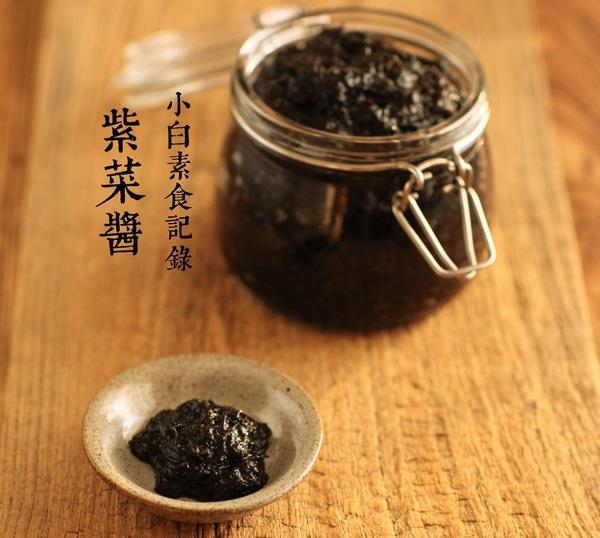

# 紫菜酱

## 📋 基本資訊 / Recipe Overview
- **料理名稱**：紫菜酱
- **原始標題**：紫菜酱
- **素食流派 / Diet**：全素 Vegan
- **料理分類 / Category**：家常蔬食 / 经典热菜
- **來源平台 / Source**：[下廚房 · 素食主義專區](https://www.xiachufang.com/recipe/1076836/)

## 🌿 食材及佐料清單 / Ingredients
- 50g紫菜
- 400g热水
- 100g酱油
- 20g白糖
- 1大匙味淋（可省略）

## 🍳 烹飪步驟 / Step-by-Step Cooking Steps
1. 紫菜，买无砂的免洗的可以直接吃的通常用来煮汤的那种。用手撕成小块（大小可根据喜好掌握，如果你喜欢吃到紫菜的口感，就不要撕太小，如果喜欢吃完全酱状的，可以泡软后用搅拌机打碎碎）用400g的热水泡软，热水可以快速把紫菜泡软，紫菜体积变小了一大半，把热水全部吸收啦。
2. 然后，把紫菜倒入锅中（热水全部被紫菜吸收掉了，所以应该不会有额外的水）加入糖、酱油（我用的六月鲜）还有味淋，这个可以省略的，影响不大，小火煮个5分钟，往一个方向搅拌。ok,装入干净无油无水的容器中，冷却到常温后移入冰箱冷藏。

## 💡 大廚美味秘訣 / Chef's Tips
- 1.紫菜最好选这种免洗无砂的，免得洗的过程中又把鲜味洗掉了~ 
2.酱油根据品牌不同，咸淡度不同所以适当调整。用生抽、头抽都可以，有日本淡口酱油也行，千万不要用老抽哈 
3.按照本方的一半分量做出来应该是平常的果酱瓶那样一瓶~

---
*食譜歸檔時間：2026-08-20 · 來源：下廚房 (www.xiachufang.com)*