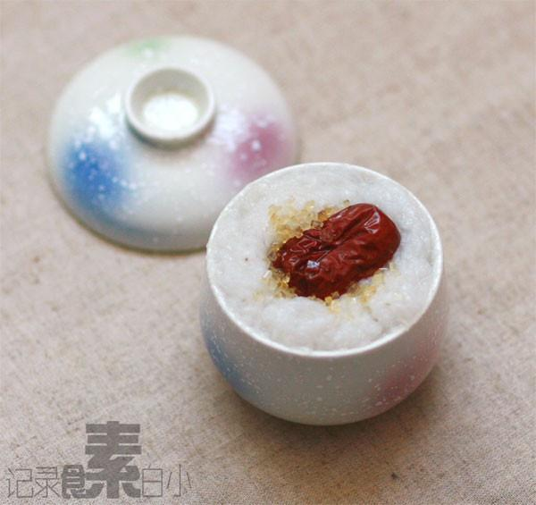

# 红枣蒸山药泥

## 📋 基本資訊 / Recipe Overview
- **料理名稱**：红枣蒸山药泥
- **原始標題**：红枣蒸山药泥
- **素食流派 / Diet**：全素 Vegan
- **料理分類 / Category**：家常蔬食 / 经典热菜
- **來源平台 / Source**：[下廚房 · 素食主義專區](https://www.xiachufang.com/recipe/1000492/)

## 🌿 食材及佐料清單 / Ingredients
- 山药
- 红枣
- 白糖

## 🍳 烹飪步驟 / Step-by-Step Cooking Steps
1. 用擦丝器最细的那一面，把生山药擦成泥状（如果有日式磨碗更佳）
2. 将生山药泥和少许糖拌匀，再加两颗红枣一起放到容器中，上锅蒸20分钟即可
3. 建议最好用日式的陶瓷磨碗来磨山药泥，这样山药泥能保持洁白漂亮的颜色，如果用金属的擦丝器就很容易变的黑乎乎的。另外跟山药的品质也有关系，普通的山药就更容易氧化，细的铁棍山药就没那么容易氧化~如果不在意卖相的话就无所谓，氧化不影响口感 
这道甜品的很补肾气~山药是个好东西，含有丰富的淀粉、蛋白质、无机盐和多种维生素(如维生素B1、维生素B2、烟酸、抗坏血酸、胡萝卜素)等营养物质，还含有多量纤维素以及胆碱、粘液质等成分。山药最大的特点是能够供给人体大量的粘液蛋白。这是一种多糖蛋白质，对人体有特殊的保健作用，能预防心血管系统的脂肪沉积，保持血管的弹性，防止动脉粥样硬化过早发生，减少皮下脂肪沉积，避免出现肥胖。所以，山药是一种非常理想的减肥健美食品。欲减肥者可以把山药作为主食，这样既可避免因节食对人体功能造成不良影响，又利于达到减肥目的。

## 💡 大廚美味秘訣 / Chef's Tips
- 山药甜品普遍的做法是 蓝莓山药，山药糕等等，都是先蒸后压泥的做法 
今天我尝试先把山药擦成泥，然后再蒸，风味很不一样，蒸好的山药有点呈慕斯状，很糯滑。 
山药的粘液沾到手上会发痒，建议最好带厨房手套

---
*食譜歸檔時間：2026-08-20 · 來源：下廚房 (www.xiachufang.com)*