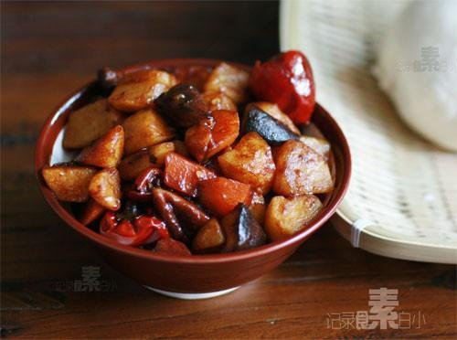

# 红烧土豆

## 📋 基本資訊 / Recipe Overview
- **料理名稱**：红烧土豆
- **原始標題**：红烧土豆
- **素食流派 / Diet**：全素 Vegan
- **料理分類 / Category**：家常蔬食 / 经典热菜
- **來源平台 / Source**：[下廚房 · 素食主義專區](https://www.xiachufang.com/recipe/1001083/)

## 🌿 食材及佐料清單 / Ingredients
- 一两个土豆
- 一根胡萝卜
- 四五朵香菇
- 1/2小匙盐
- 2大匙老抽
- 三四粒冰糖
- 一个八角

## 🍳 烹飪步驟 / Step-by-Step Cooking Steps
1. 土豆胡萝卜去皮切滚刀块，香菇去蒂切块
2. 锅烧热，下油，放入一个八角炒香，下入切好的土豆胡萝卜和香菇翻炒一下
3. 加水快要没过土豆，中小火烧十来分钟
4. 尝下土豆熟了没有，加盐，老抽和几块冰糖调味翻炒，收汁浓稠即可出锅

## 💡 大廚美味秘訣 / Chef's Tips
- 红烧土豆，家常下饭菜，做起来简单的很~

---
*食譜歸檔時間：2026-08-20 · 來源：下廚房 (www.xiachufang.com)*