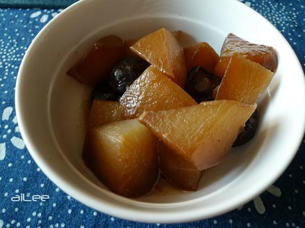

# 红烧白萝卜

## 📋 基本資訊 / Recipe Overview
- **料理名稱**：红烧白萝卜
- **原始標題**：红烧白萝卜
- **素食流派 / Diet**：全素 Vegan
- **料理分類 / Category**：家常蔬食 / 经典热菜
- **來源平台 / Source**：[下廚房 · 素食主義專區](https://www.xiachufang.com/recipe/1009054/)

## 🌿 食材及佐料清單 / Ingredients
- 1个白萝卜
- 6朵香菇
- 少量油
- 少量盐
- 适量酱油
- 少许糖
- 1大碗水

## 🍳 烹飪步驟 / Step-by-Step Cooking Steps
1. 萝卜去皮切滚刀块
2. 锅中热油，加入泡好的香菇、萝卜、盐、酱油、糖，加一大碗水，加盖文火20分钟

---
*食譜歸檔時間：2026-08-20 · 來源：下廚房 (www.xiachufang.com)*