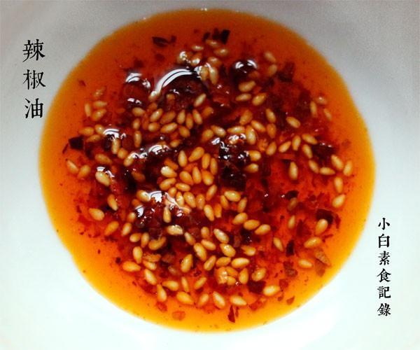

# 红红辣椒油

## 📋 基本資訊 / Recipe Overview
- **料理名稱**：红红辣椒油
- **原始標題**：红红辣椒油
- **素食流派 / Diet**：全素 Vegan
- **料理分類 / Category**：面食主食
- **來源平台 / Source**：[下廚房 · 素食主義專區](https://www.xiachufang.com/recipe/1025892/)

## 🌿 食材及佐料清單 / Ingredients
- 3大匙粗辣椒粉
- 1大匙熟芝麻
- 4大匙（60ML）油
- 1小匙盐

## 🍳 烹飪步驟 / Step-by-Step Cooking Steps
1. 首先准备粗辣椒粉，太细的泼的时候容易颜色黑。增加香味所以添了多多的熟芝麻
2. 先将2大匙辣椒粉、1小匙盐、1大匙芝麻放入无水干爽的碗中混合均匀
3. 锅中烧热60ml的油，烧到油微微冒烟了即可关火，把锅移开灶台10秒钟，浇入混合辣椒的碗中，快速用小勺搅拌均匀
4. 等几分钟，用手摸碗壁，微微有些烫手的程度时，加入一小匙辣椒粉拌匀。再静置一会，用手摸碗壁，摸起来不烫手但是温温的，此时再加1小匙辣椒粉进去拌匀。接着静置到辣椒油冷却至常温，摸碗壁是凉的，再加入最后1小匙辣椒粉拌匀即可

## 💡 大廚美味秘訣 / Chef's Tips
- 用这种方法作出的辣椒油不但味道香，而且颜色特别漂亮~淋一点在凉菜上~立马增色不少，艳丽的红色起到很好的装饰作用 
常温可保存两个月没问题~ 
分三次加辣椒粉的，有点像西餐里用油浸泡东西的原理，低温浸泡，不破坏颜色

---
*食譜歸檔時間：2026-08-20 · 來源：下廚房 (www.xiachufang.com)*