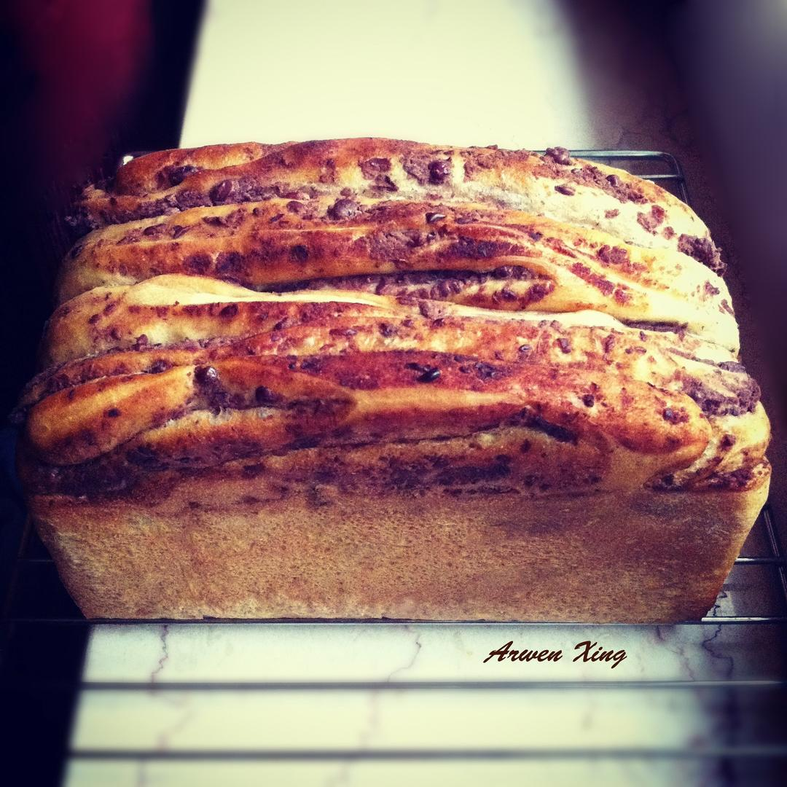

# 红豆吐司

## 📋 基本資訊 / Recipe Overview
- **料理名稱**：红豆吐司
- **原始標題**：红豆吐司
- **素食流派 / Diet**：全素 Vegan
- **料理分類 / Category**：面食主食
- **來源平台 / Source**：[下廚房 · 素食主義專區](https://www.xiachufang.com/recipe/1074889/)

## 🌿 食材及佐料清單 / Ingredients
- 270g高筋面粉
- 160ml温水
- 1汤匙白糖
- 20ml玉米油
- 1茶匙盐
- 1茶匙酵母
- 适量红豆馅

## 🍳 烹飪步驟 / Step-by-Step Cooking Steps
1. 将酵母、白糖放入温水中混合搅拌均匀
2. 将酵母液放入高粉中混合均匀，揉成光滑的面团，面团揉至拉起能形成蜂窝状时放入玉米油，揉至扩展阶段
3. 将面团放置温暖处发酵至原面团的两倍大，手指沾面粉在面团中央戳一下，不回缩即发酵完成
4. 对发酵好的面团进行排气，静置松弛15分钟
5. 将松弛好的面团擀成长方形，在面片的2/3出均匀抹上红豆馅
6. 将面片折成3折，未涂抹红豆馅的部分先向中间折，擀成长方形
7. 再次折成3折，擀成长方形
8. 再次折成3折，将折好的面团从中间一切为二
9. 切面朝上放入吐司模具中，放置温暖处进行二次发酵
10. 面团发酵至八、九分满时，在面团表面均匀刷上少许玉米油 
烤箱180度预热10分钟
11. 180度，下层，上下火40分钟，面包表面上色后盖上锡纸继续烤制
12. 面包烤好后脱模晾凉即可

## 💡 大廚美味秘訣 / Chef's Tips
- 每每经过面包店都会被各类吐司吸引，利用椰蓉吐司的整形方法做出的红豆吐司，包裹自制红豆馅，避免了无谓的添加剂，松软可口，香甜自然！ 
自制红豆馅：http://www.xiachufang.com/recipe/1074275/ 
参考分量：450g吐司模

---
*食譜歸檔時間：2026-08-20 · 來源：下廚房 (www.xiachufang.com)*