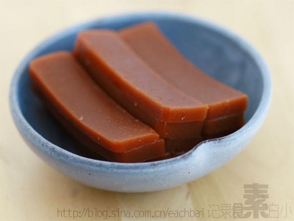

# 红豆羊羹

## 📋 基本資訊 / Recipe Overview
- **料理名稱**：红豆羊羹
- **原始標題**：红豆羊羹
- **素食流派 / Diet**：全素 Vegan
- **料理分類 / Category**：养生汤品
- **來源平台 / Source**：[下廚房 · 素食主義專區](https://www.xiachufang.com/recipe/1000505/)

## 🌿 食材及佐料清單 / Ingredients
- 120g红豆沙
- 3g琼脂
- 130g水

## 🍳 烹飪步驟 / Step-by-Step Cooking Steps
1. 琼脂3g放入凉水中泡几分钟以去除杂质
2. 捞出琼脂与130G水放入锅中加热搅拌至融化
3. 豆沙倒入锅中一起搅拌加热
4. 混合物倒入容器待凉至常温后移至冰箱冷藏一个小时即可

## 💡 大廚美味秘訣 / Chef's Tips
- 步骤图请看http://blog.sina.com.cn/s/blog_60b49a1e0100q0ny.html

---
*食譜歸檔時間：2026-08-20 · 來源：下廚房 (www.xiachufang.com)*