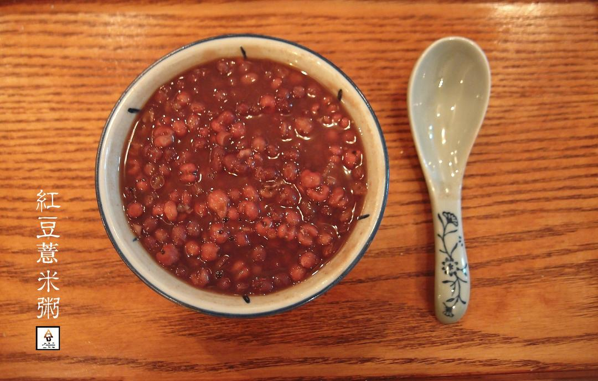

# 红豆薏米粥 Red Bean and Pearl Barley Congee

## 📋 基本資訊 / Recipe Overview
- **料理名稱**：红豆薏米粥 Red Bean and Pearl Barley Congee
- **原始標題**：红豆薏米粥 (Red Bean and Pearl Barley Congee)
- **素食流派 / Diet**：全素 Vegan
- **料理分類 / Category**：米食主食
- **來源平台 / Source**：[下廚房 · 素食主義專區](https://www.xiachufang.com/recipe/1089551/)

## 🌿 食材及佐料清單 / Ingredients
- 60克红豆
- 30克薏米
- 适量红糖

## 🍳 烹飪步驟 / Step-by-Step Cooking Steps
1. 红豆和薏米各泡四个小时以上；
2. 泡豆的水倒掉把豆子洗净，放入装了一升水的锅内，水开后盖盖中小火煮一个小时以上，看到红豆和薏米软烂就可以了，如果要放糖的话在出锅之前放。

## 💡 大廚美味秘訣 / Chef's Tips
- 红豆薏米健脾祛湿，推荐梅雨季节喝。可以多放点水煮红豆薏米茶，也可以根据此方做成
两人份

---
*食譜歸檔時間：2026-08-20 · 來源：下廚房 (www.xiachufang.com)*