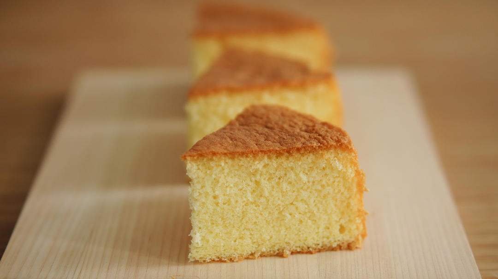

# 经典海绵蛋糕 「海绵及其衍生」烘焙视频蛋糕篇3

## 📋 基本資訊 / Recipe Overview
- **料理名稱**：经典海绵蛋糕 「海绵及其衍生」烘焙视频蛋糕篇3
- **原始標題**：经典海绵蛋糕/「海绵及其衍生」烘焙视频蛋糕篇3
- **素食流派 / Diet**：蛋奶素 Ovo-Lacto
- **料理分類 / Category**：面食主食
- **來源平台 / Source**：[下廚房 · 素食主義專區](https://www.xiachufang.com/recipe/102280309/)

## 🌿 食材及佐料清單 / Ingredients
- #6寸配方，八寸翻倍#
- 2个鸡蛋
- 60克低筋面粉
- 20克牛奶
- 20克黄油
- 50克细砂糖

## 🍳 烹飪步驟 / Step-by-Step Cooking Steps
1. 不同于戚风，海绵蛋糕需要垫油纸。
裁取宽6cm左右的蛋糕围边。
2. 再剪一个圆形垫片。
（具体操作请看视频）
3. 模具内侧涂黄油。
4. 铺上油纸。
5. 烤箱预热到170℃。
准备工作完成：）
6. 准备一锅水，加热到略微烫手后关火，隔水加热蛋液。
（水温在60℃左右，家庭操作不用温度计，指尖感觉烫手即可。）
7. 放上打蛋盆，底部接触水面。
打入鸡蛋，倒入砂糖。
8. 搅打至砂糖融化，蛋液温度与指尖接近。
（全蛋液在37℃左右最易打发，我们可以用指尖感受温度，感觉温热即可。就不用温度计了。）
9. 最高速打发鸡蛋。
10. 直到蛋糊蓬松结实，划8字痕迹不会消失。
（打了多久？
2分40秒左右。）
11. 打发完成后，低速搅打30秒消除大气泡。
然后低速缓慢提起甩掉打蛋器上的面糊。
12. 取出蛋糊，换油奶混合物隔水加热至黄油融化。
13. 与此同时我们来搅拌面糊。
筛入低粉。
14. 用蛋抽以捞拌手法拌匀面糊。
均匀混合的方式是三方同时转动——
1.蛋抽自转（手腕转动蛋抽）
2.左手转动打蛋盆。
3.蛋抽划过打蛋盆底部向上捞起。

这样操作可以打散结块面粉，也不会有底部蛋液混合不均的情况出现。
打蛋器的钢丝可以很好的拌匀面糊。
15. 蛋糊会附着在蛋抽上，砸回去。
16. 混合到看不见干粉就停止。
把融化好的液体搅拌均匀，挖一勺蛋糊和液体搅拌均匀。
（不用担心消泡，画圈拌匀就好。）
这一勺子蛋糊是用来稀释液体的，不用太束缚。
17. 利用蛋抽引流，均匀地倒在蛋糊上。
18. 继续按之前的方式捞拌均匀。
19. 最后用刮刀将盆壁面糊整理干净。
20. 入模。
21. 表面轻轻抹平。
（成功的面糊应该是蓬松粘稠的，入模后不会马上流平）
22. 震出大气泡。
23. 170℃，30-35分钟，直至表面金褐色。
（8寸为170℃40分钟左右，直至表面呈现金褐色。）
24. 出炉后马上脱模，正面朝上晾凉。
完全冷却后再撕去油纸。

## 💡 大廚美味秘訣 / Chef's Tips
- 如果要做多层蛋糕的承重胚，可以晾凉后用保鲜袋装好扎紧冷藏一夜再切片。
这样蛋糕会紧实好切片，也会更结实。
同时也给蛋糕回油的时间，刚刚烤出来会比较干。

---
*食譜歸檔時間：2026-08-20 · 來源：下廚房 (www.xiachufang.com)*