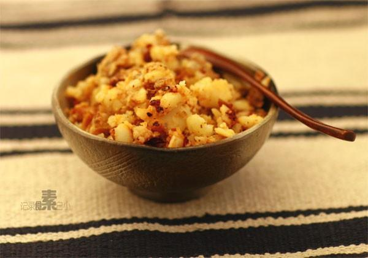

# 老奶洋芋

## 📋 基本資訊 / Recipe Overview
- **料理名稱**：老奶洋芋
- **原始標題**：老奶洋芋
- **素食流派 / Diet**：全素 Vegan
- **料理分類 / Category**：面食主食
- **來源平台 / Source**：[下廚房 · 素食主義專區](https://www.xiachufang.com/recipe/1000438/)

## 🌿 食材及佐料清單 / Ingredients
- 土豆
- 花椒粉
- 辣椒粉
- 盐

## 🍳 烹飪步驟 / Step-by-Step Cooking Steps
1. 土豆洗干净，上锅蒸或者煮熟（以筷子轻易插入为标准）
2. 去皮，用勺子将熟土豆压碎，不要太碎才正宗~
3. 起锅烧少许油，先将花椒面，辣椒面下入小火炒香，再将压碎的土豆下入翻炒，最后加盐拌匀~

## 💡 大廚美味秘訣 / Chef's Tips
- 可根据口味加点少量孜然

---
*食譜歸檔時間：2026-08-20 · 來源：下廚房 (www.xiachufang.com)*