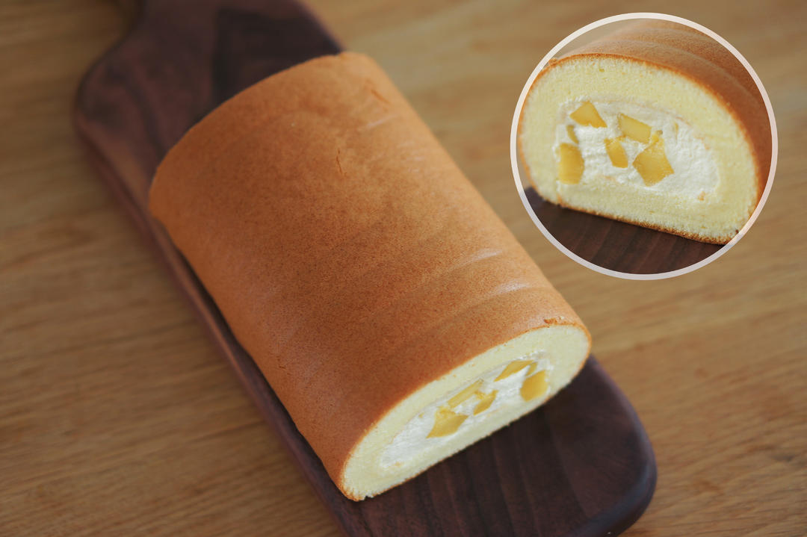

# 胖乎乎奶油芒果卷 不开裂不掉皮全过程详细图解烘焙视频 蛋糕篇6：「厚卷」

## 📋 基本資訊 / Recipe Overview
- **料理名稱**：胖乎乎奶油芒果卷 不开裂不掉皮全过程详细图解烘焙视频 蛋糕篇6：「厚卷」
- **原始標題**：胖乎乎奶油芒果卷/不开裂不掉皮全过程详细图解烘焙视频/蛋糕篇6：「厚卷」
- **素食流派 / Diet**：蛋奶素 Ovo-Lacto
- **料理分類 / Category**：面食主食
- **來源平台 / Source**：[下廚房 · 素食主義專區](https://www.xiachufang.com/recipe/102311306/)

## 🌿 食材及佐料清單 / Ingredients
- #蛋糕胚配方（适用28*28cm烤盘）#
- 5个鸡蛋
- 90克白砂糖
- 90克低筋面粉
- 70克牛奶
- 70克植物油
- #夹馅#
- 250g淡奶油
- 25克白砂糖
- 200g（净重）芒果
- 几滴香草精

## 🍳 烹飪步驟 / Step-by-Step Cooking Steps
1. 准备工作：
1.烤箱预热到180℃。
2.烤盘涂油（用纸巾蘸植物油，我们炒菜那种）
2. 3.裁硅油纸（油纸和硅油纸的区别见此http://www.xiachufang.com/recipe/102299400/），
未熟练前不建议用油纸，硅油纸有不沾图层且有硬度，不会粘上蛋糕糊后软趴趴的，撕开也方便。
3. 剪刀按图中红色箭头方向剪开，两边要略长烤盘2-3cm。
4. 4.铺实，整理边缘，使其与烤盘贴合。
准备工作完成。
5. 接下来制作蛋糕胚。
将植物油，牛奶，香草精和过筛的面粉混合成湿软的面团。
6. 此时面团不粘盆也不沾蛋抽。
7. 加入蛋黄。
8. 搅拌成细腻的蛋黄糊。
9. 打发蛋白，分三次下糖。
10. 直到湿性发泡。
11. 挖一勺蛋白霜和蛋黄糊拌匀。
12. 倒回蛋白霜中。
13. 拌匀，结块的地方打散。
14. 形成细腻流畅的面糊。
15. 用刮刀整理面糊。
16. 倒入烤盘。
17. 用刮板将面糊推到四角。
18. 刮平蛋糕糊。
注意：
1.一步到位，不要来回抹。
2.刮板不要沾到油纸。
3.力度越来越轻，最后轻轻提起不留痕迹。
19. 刮平动图
20. 震出大气泡。
21. 180℃，中层，烘焙25分钟（如有热风功能，最后3分钟开热风）
直到表面金褐色，指尖轻触干燥略微发硬即可。
22. 出炉后震出热气，盖上硅油纸（左右各长烤盘15cm），扣上晾网。
不熟练前不建议用油纸替代硅油纸。
因为油纸比较薄，后面用力抽紧的时候容易撕裂。
23. 把蛋糕卷翻过来。
24. 拿掉烤盘。
25. 撕开油纸。
26. 盖回去。
蛋糕体完成。
27. 淡奶油+香草精+白砂糖打发。
（天气热，最好隔冰水）
28. 打硬一点会好卷。
29. 重头戏来了！
准备卷蛋糕！
拿笔记本，搬小凳子，注意划重点！（正经脸）

重点一：
桌子上铺硅胶垫防滑。
（否则油纸会滑动）
30. 提起盖在蛋糕上的硅油纸（翻转后在下方）长出来的部分，把蛋糕转移到硅胶垫上。
重点二：
硅油纸长出来的部分要在前后而非左右。
这段多余的纸张是要用来包裹擀面杖的。
31. 斜切掉身体一侧和对面的蛋糕边缘。
32. 挖一半淡奶油抹开。
33. 重点三：
靠近身体一侧2cm薄薄涂一层就好。
34. 铺上芒果。
35. 把剩下的淡奶油涂上去。
重点四：
奶油要把芒果的间隙填满，压实，不然会有空洞也不好卷。
36. 这是一个需要三维想象力的图解。
37. 踢掉板凳站起来！
卷蛋糕了！

右手用擀面棍提起油纸。
38. 左手轻轻固定蛋糕前端。
39. 一鼓作气往前卷，直到擀面棍碰到垫子。

重点中的重点：
动作要快！姿势要帅！不要犹豫！
迟疑没得吃，手抖就得懵！
40. 最后，右手摁住擀面棍往身体方向拉，左手反方向往前抽紧下方油纸，拉实蛋糕卷。
41. 动图
42. 冷藏定型后切块，蛋糕卷就做好啦~

## 💡 大廚美味秘訣 / Chef's Tips
- 说一下阿猪个人的偏好。
无论做任何食物（或事情），阿猪个人觉得重要的是平衡。
就像蛋糕卷，不是说奶油好吃，我就蛋糕体做的特别薄，奶油往死里加，这看起来的确诱人，但就像给你一碗只有牛肉没有面的牛肉面，能长期吃下去吗？
原料价格有高低，然而食物无贵贱，浓郁的奶油需要有质感有厚度的细腻蛋糕胚衬托她奶香醇郁的口感，就像米饭和肉菜，三餐顿顿白米饭肯定寡然无味，但不吃饭顿顿大鱼大肉也不舒服。

我心目中「好」的食物，最重要的只有2点。
一是美味（个人觉得标着噱头卖高价但不好吃的食物都是耍流氓）
二是舒适（饥肠辘辘的热饭菜，劳累过后的青菜粥，食物抚慰的不只是味蕾，还有心情的愉悦）

网红食物很多，时兴潮起而潮落，我只是想踏踏实实地把美味而舒适的食物和大家分享罢了。
有感而发，说的太多，不好意思啊

---
*食譜歸檔時間：2026-08-20 · 來源：下廚房 (www.xiachufang.com)*