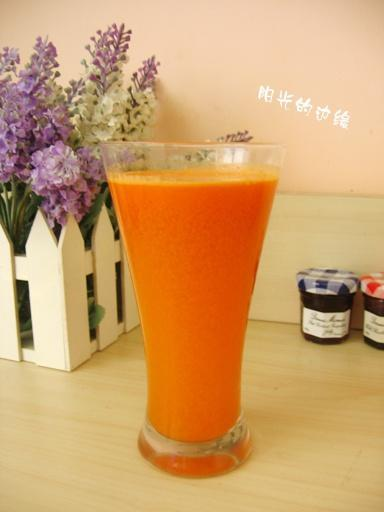

# 胡萝卜苹果汁

## 📋 基本資訊 / Recipe Overview
- **料理名稱**：胡萝卜苹果汁
- **原始標題**：胡萝卜苹果汁
- **素食流派 / Diet**：全素 Vegan
- **料理分類 / Category**：家常蔬食 / 经典热菜
- **來源平台 / Source**：[下廚房 · 素食主義專區](https://www.xiachufang.com/recipe/257528/)

## 🌿 食材及佐料清單 / Ingredients
- 2根胡萝卜
- 1个苹果

## 🍳 烹飪步驟 / Step-by-Step Cooking Steps
1. 材料全部切碎，先榨胡萝卜汁再榨苹果

## 💡 大廚美味秘訣 / Chef's Tips
- 1、因为苹果氧化快，一般放在最后榨汁。 
2、鲜榨果汁要尽快饮用，半小时内最佳。

---
*食譜歸檔時間：2026-08-20 · 來源：下廚房 (www.xiachufang.com)*