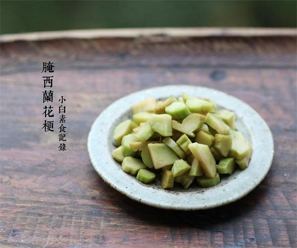

# 腌西兰花梗

## 📋 基本資訊 / Recipe Overview
- **料理名稱**：腌西兰花梗
- **原始標題**：腌西兰花梗
- **素食流派 / Diet**：全素 Vegan
- **料理分類 / Category**：爽口凉菜
- **來源平台 / Source**：[下廚房 · 素食主義專區](https://www.xiachufang.com/recipe/1056628/)

## 🌿 食材及佐料清單 / Ingredients
- 一个西兰花梗
- 1/2小匙盐
- 1大匙陈醋
- 1大匙生抽
- 1/4小匙糖

## 🍳 烹飪步驟 / Step-by-Step Cooking Steps
1. 首先把西兰花梗外面厚厚的皮削掉，切成厚片或小丁，建议不要切薄片，这样口感吃起来会脆脆的
2. 把切好的丁放入一个保鲜盒里，加入1/2小匙盐，盖上保鲜盒的盖子，摇晃盒子，这样就拌匀了~静置半小时，然后把腌出来的水倒掉（一定要倒掉，否则会过咸）
3. 接着，倒入醋、生抽和糖，再盖上保鲜盒盖子摇匀，放入冰箱冷藏一夜即可~如果你喜欢吃辣也可以加一点辣椒油

## 💡 大廚美味秘訣 / Chef's Tips
- 建议醋一定不要放太少~很关键

---
*食譜歸檔時間：2026-08-20 · 來源：下廚房 (www.xiachufang.com)*