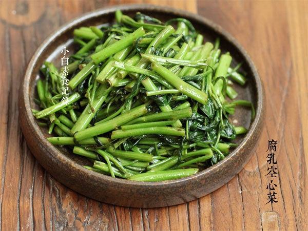

# 腐乳空心菜

## 📋 基本資訊 / Recipe Overview
- **料理名稱**：腐乳空心菜
- **原始標題**：腐乳空心菜
- **素食流派 / Diet**：全素 Vegan
- **料理分類 / Category**：家常蔬食 / 经典热菜
- **來源平台 / Source**：[下廚房 · 素食主義專區](https://www.xiachufang.com/recipe/1064870/)

## 🌿 食材及佐料清單 / Ingredients
- 一捆空心菜
- 2小匙红腐乳

## 🍳 烹飪步驟 / Step-by-Step Cooking Steps
1. 首先把空心菜去掉老的叶茎，洗净，然后大致在茎叶分界处把它一切两半，之后分别切成寸段控干水分待用
2. 一捆空心菜，大概用1/3块豆腐乳加上1小匙腐乳汁，这样咸度刚刚好，将腐乳汁和腐乳块一起搅散成汁，如果太稠，就加1小匙的水拌匀待用。
3. 炒锅大火烧热，下1大匙的油，转一下锅让油均匀的分布在锅中，先下空心菜梗快速翻炒至颜色变翠绿，接着下空心菜叶快速翻炒至叶子塌软，然后倒入腐乳汁，关火，利用锅的余热拌炒均匀即可。

## 💡 大廚美味秘訣 / Chef's Tips
- 炒这道菜一定要用大火，动作稍快一点就可以了 
这样可以保证菜的口感，炒好了也不会出什么水 
记住不用再放其他调料了哦 
三要素，叶茎分开，控干水分，大火快炒

---
*食譜歸檔時間：2026-08-20 · 來源：下廚房 (www.xiachufang.com)*