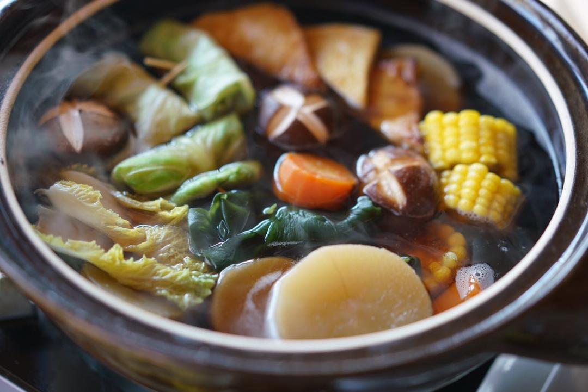

# 自制关东煮

## 📋 基本資訊 / Recipe Overview
- **料理名稱**：自制关东煮
- **原始標題**：自制关东煮
- **素食流派 / Diet**：全素 Vegan
- **料理分類 / Category**：养生汤品
- **來源平台 / Source**：[下廚房 · 素食主義專區](https://www.xiachufang.com/recipe/1016994/)

## 🌿 食材及佐料清單 / Ingredients
- 2片（宽海带）昆布
- #汤底#
- 一根白萝卜
- 以个苹果
- 一小根胡萝卜
- 四五朵干香菇
- 4厘米*3段昆布（或干海带）
- 2大匙生抽
- 1小匙盐
- 3L水
- #配菜
- 圆白菜
- 煎豆腐
- 海带结
- 娃娃菜
- 鲜香菇或平菇
- 玉米

## 🍳 烹飪步驟 / Step-by-Step Cooking Steps
1. 首先把干香菇用冷水浸泡4小时或一夜，干燥的昆布（你可以理解成海带的一种）用湿布擦下表面灰尘，剪成4cm左右，用500ml冷水浸泡4小时或一夜。
2. 白萝卜去皮切成3cm左右厚的段，胡萝卜去皮切段，苹果洗净不用去皮一切四
3. 汤底：3L冷水放入大锅中，把白萝卜香菇胡萝卜苹果放入，泡好的昆布连同浸泡昆布的水一起放入，开火，煮开后转小火煮2小时，这样你会得到特别好吃筷子一碰就碎甜甜的白萝卜，煮好的汤中把不吃的干香菇、昆布、苹果捞出，加入盐和酱油锅底做好。
4. 配菜：
圆白菜叶子尽量完整的掰下来，用开水烫软，捞出放入冷水中保持绿色，然后卷成卷用牙签固定
5. 香菇切花，很多人以为香菇划个十字然后煮一下它就会有花。。。不是这样的，要用切的
6. 其它配菜，豆腐煎至两面金黄，然后菇类可以用新鲜的香菇平菇，蔬菜推荐娃娃菜，当然还可以泡一点海带结、魔芋豆腐或者魔芋丝，甜玉米，等等都不错~
7. 汤底端上桌，开火，下入各种配菜煮熟~吃到最后可以煮乌冬面~

## 💡 大廚美味秘訣 / Chef's Tips
- 用苹果煮汤底，味道非常赞，自然的甘甜，不用再加糖或味淋之类的了，单喝热乎乎的汤头都是非常美味，试着把简单的关东煮变成火锅的形式，把各种配菜放在里面煮，朋友们可以围在一起分享，非常适合在家小聚，最后还可以煮个乌冬面什么的收尾
以下份量适合4人分享

---
*食譜歸檔時間：2026-08-20 · 來源：下廚房 (www.xiachufang.com)*