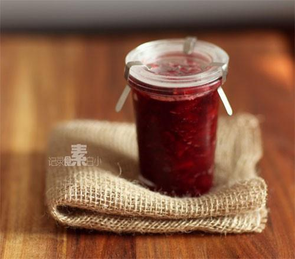

# 自制无添加樱桃果酱

## 📋 基本資訊 / Recipe Overview
- **料理名稱**：自制无添加樱桃果酱
- **原始標題**：自制无添加樱桃果酱
- **素食流派 / Diet**：全素 Vegan
- **料理分類 / Category**：家常蔬食 / 经典热菜
- **來源平台 / Source**：[下廚房 · 素食主義專區](https://www.xiachufang.com/recipe/1001808/)

## 🌿 食材及佐料清單 / Ingredients
- 300g樱桃
- 50g白糖
- 50g冰糖
- 25ml柠檬汁

## 🍳 烹飪步驟 / Step-by-Step Cooking Steps
1. 樱桃洗净，用刀顺着果肉划一圈，拧一下，去核留肉
2. 樱桃果肉撒果肉六分之一重量的白糖，拌匀，搁在一旁一小时以上.让果肉中的果胶析出
3. 腌好的果肉和汤汁一起倒入锅中，加上跟白糖等量的冰糖和两勺柠檬汁一起小火加热半个小时至40分钟,煮开后要不断搅拌以免糊底，直至果酱粘稠关火
4. 装的洁净干燥的密封瓶中密封，待冷至常温后放冰箱冷藏

## 💡 大廚美味秘訣 / Chef's Tips
- 这次的樱桃微酸，所以总糖量加到了果肉的1/3.效果非常粘稠，有镜面般的果胶~很成功 
 每次取果酱的时候也要用干爽洁净的勺子，不能抱着瓶子吃啊~沾到口水的果酱，很快会坏掉~ 
 保存好的话半年一年都不成问题

---
*食譜歸檔時間：2026-08-20 · 來源：下廚房 (www.xiachufang.com)*