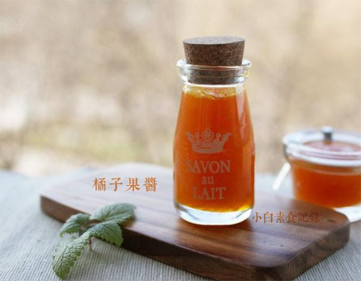

# 自制无添加橘子果酱

## 📋 基本資訊 / Recipe Overview
- **料理名稱**：自制无添加橘子果酱
- **原始標題**：自制无添加橘子果酱
- **素食流派 / Diet**：全素 Vegan
- **料理分類 / Category**：家常蔬食 / 经典热菜
- **來源平台 / Source**：[下廚房 · 素食主義專區](https://www.xiachufang.com/recipe/1011244/)

## 🌿 食材及佐料清單 / Ingredients
- 500g橘子
- 50g冰糖

## 🍳 烹飪步驟 / Step-by-Step Cooking Steps
1. 取一只结实的橘子洗干净表面，用柠檬皮刀或擦丝器将表面橘红色皮擦成细丝，不要白色部分，会发苦，然后将橘皮丝加少许盐腌10分钟左右，用水反复洗净，挤掉水分待用
2. 所有的橘子剥掉外皮，再去掉白色的筋和内膜，并去掉籽，留果肉和汁
3. 用手将果肉抓散，连汁倒入锅中，加入冰糖和橘皮丝开始小火煮，大概煮半个小时，期间隔三差五的 搅拌一下，直到开始变得粘稠，就可以关火了，冷却后会更加粘稠
4. 趁热装入可密封的瓶子中，密封好后倒置，冷却后移冰箱可保存很久
5. 每次用干净无水的勺子取果酱，以防变质~

## 💡 大廚美味秘訣 / Chef's Tips
- 橘子皮用一两只橘子的就够了，用结实的橘子擦皮比较省力，橘子皮可以增加口感和香气，因为橘皮是提炼精油的原料哦~ 
可抹面包，也可以舀一勺与红茶一起用沸水冲泡~ 
颜色多漂亮~食物本身的色彩，搞不懂为啥外面卖的果酱还要放色素~

---
*食譜歸檔時間：2026-08-20 · 來源：下廚房 (www.xiachufang.com)*