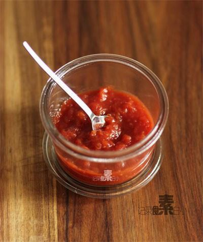

# 自制无添加番茄酱

## 📋 基本資訊 / Recipe Overview
- **料理名稱**：自制无添加番茄酱
- **原始標題**：自制无添加番茄酱
- **素食流派 / Diet**：全素 Vegan
- **料理分類 / Category**：家常蔬食 / 经典热菜
- **來源平台 / Source**：[下廚房 · 素食主義專區](https://www.xiachufang.com/recipe/1002009/)

## 🌿 食材及佐料清單 / Ingredients
- 中等大小5个西红柿
- 20g冰糖
- 一茶勺5ml盐
- 半个柠檬挤汁柠檬汁

## 🍳 烹飪步驟 / Step-by-Step Cooking Steps
1. 西红柿顶部用刀划十字，底部蒂用刀抠出
2. 锅中水烧开，放入番茄烫一分钟，捞出去皮，小心烫手~
3. 用手将西红柿挤碎，不用太碎，有点果肉更有口感
4. 挤碎的西红柿放锅中，加入冰糖，柠檬汁小火煮半个小时以上 期间要搅拌以防糊底，待汤汁浓稠，没有太多水分的时候加入盐拌匀装瓶

## 💡 大廚美味秘訣 / Chef's Tips
- 1.酱趁热放入干爽洁净的瓶中密封，待凉放冰箱冷藏，因为这个含糖量少所以保存时间没有果酱 的时间长，每次要用干净的勺子取酱，冷藏可保存一个月。 
 2.柠檬汁是天然的酸味剂，还有抗氧化延长保存期的作用。 
3.自家吃的话，西红柿不需要去籽，不会影响口感。 
4.挑选熟透的西红柿最佳。

---
*食譜歸檔時間：2026-08-20 · 來源：下廚房 (www.xiachufang.com)*