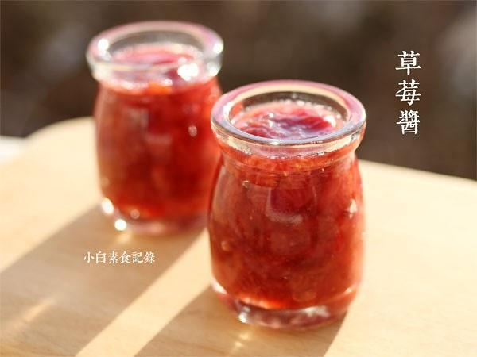

# 自制无添加草莓酱

## 📋 基本資訊 / Recipe Overview
- **料理名稱**：自制无添加草莓酱
- **原始標題**：自制无添加草莓酱
- **素食流派 / Diet**：全素 Vegan
- **料理分類 / Category**：家常蔬食 / 经典热菜
- **來源平台 / Source**：[下廚房 · 素食主義專區](https://www.xiachufang.com/recipe/1029367/)

## 🌿 食材及佐料清單 / Ingredients
- 350g草莓
- 70g白糖或冰糖
- 半个柠檬

## 🍳 烹飪步驟 / Step-by-Step Cooking Steps
1. 草莓去蒂洗净，切成小块，加入白糖用手捏，这样可保留一部分果肉口感更好，让糖和草莓混合，静置半小时让果胶析出
2. 处理好的草莓肉放入锅中，不要加水，小火加热半小时，期间不时搅拌以防粘锅，如果浮沫需要撇掉。然后将半个柠檬挤汁到锅中，继续加热搅拌10分钟，果酱呈粘稠状即可
3. 趁热装入无油无水可密封瓶中，凉后移冰箱冷藏，每次吃时用无水无油的勺子取

## 💡 大廚美味秘訣 / Chef's Tips
- 口味偏酸的草莓酱，不喜欢超市卖的甜的要死，但是糖的比例越高果酱保存时间越长，按这个比例做的酱建议两三周内食用完。 
柠檬汁除了调味也有抗氧化延长保存期的作用

---
*食譜歸檔時間：2026-08-20 · 來源：下廚房 (www.xiachufang.com)*